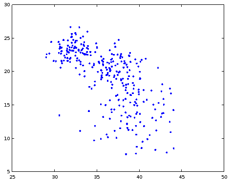

# Поиск кластеров алгоритмом k-средних

## Условие задачи

Алгоритм k-средних получает на вход множество точек, число `k` и разбивает точки на `k` множеств так, что точки одного множества визуально образовывали группу (кластер). Например, на рисунке ниже точки образуют три кластера:

Формально, вам необходимо создать функцю `k_means`, которая получает на вход матрицу точек (точки расположены по строкам), число `k` и возвращает матрицу-столбец с номерами кластеров от 1 до `k`. Высота матрицы с результатом равна высоте исходной матрицы.

Для того, чтобы вы могли тренироваться в кластеризации, я написал вам генератор наборов точек, образующих кластеры:

                # функция создает k кластеров
                function xy = k_means_generate_clusters(k)
                  xy = [];
                  for i = 1 : k
                    xy = [xy; generate_cluster(100)];
                  endfor
                endfunction

                # фукнция создает один кластер со случайным центром и размером
                function xy = generate_cluster(n)
                  m = rand(1, 2) * 50; # случайный центр
                  s = rand * 3 + 1; # случайный размер
                  xy = randn(n, 2) .* s + m;
                endfunction
                
Функция `k_means_generate_clusters(3)` генерирует кластеры типа таких, как изображены на рисунке выше, но иногда кластеры могут случайно пересечься, и результат будет примерно таким:

Это нормальная ситуация, в ней тоже интересно запускать алгоритм кластеризации.

## Последовательность выполнения задачи

### Шаг 1. Выбор случайных центров кластеров

Функция `centers = select_k_clusters(xy, k)` получает на вход матрицу точек и число `k`, возвращает матрицу размера \\(2\\times k\\), состоящую из `k` случайных точек. Т.е. вам нужно выбрать `k` случайных индексов строк, выбрать эти строки из `xy` и составить из них матрицу `centers`. Используйте функцию `randi`.

Эти `k` точек — это первоначальная попытка угадать центры кластеров. Конечно, центры угадаются плохо, но дальше мы будем улучшать наши догадки, пока центры не станут правильными.

### Шаг 2. Распределение точек по кластерам.

Функция `c = distribute_points(xy, centers, k)` должна по матрице точек и координатам центров распределить каждую точку к тому центру, к которому она ближе. Если точка имеет координаты \\((x, y)\\), то расстояние до центра \\((c_x, c_y)\\) равно \\(\\sqrt{(x-c_x)^2 + (y-c_y^2)}\\). При вычислении минимума корень можно не брать. Матрица `c` должна быть матрицей столбцом такой же высоты как и `xy`, в ней находятся номер того центра из матрицы `centers`, к которому точка ближе всего. Т.е. матрица `c` состоит из натуральных чисел от 1 до `k`.

Эту задачу можно решить без циклов, но, если никак не получается, так и быть, пишите цикл перебора точек. Для решения без циклов вы можете вычислить матрицу, которая для каждой точки и для каждого центра содержит расстояние между ними, после чего вам нужно воспользоваться особой формой функции `min`, которая определит минимальные элементы в матрице и вернет индексы этих элементов.

### Шаг 3. Пересчет центров кластеров

Функция `centers = reevaluate_centers(xy, c, k)` получает на вход матрицу точек, матрицу-столбец номеров кластеров точек и количество кластеров. После чего для каждого номера кластера от 1 до `k` находит все точки с этим номером и считает их центр, т.е. среднее арифметическое.

После вызова этой функции мы получаем новый набор центров кластеров. Они тоже не идеальны, но уже лучше, чем были в первый раз.

### Шаг 4. Вычисление ошибки кластеризации

Функция `I = clusterization_quality(xy, centers, c, k)` получает на вход набор точек, набор центров, номера кластеров точек, количество кластеров. Ошибка кластеризации равно сумме квадратов расстояний от каждой точки до центра ее кластера. Чем меньше получилась ошибка, тем лучше кластеризация.

Кто напишет вычисление ошибки без цикла по точкам, тот молодец. Достаточно обойтись циклом по номеру кластера. При выводе формулы вам может пригодиться, что центры кластеров — это среднее арифметическое точек этого кластера.

### Шаг 5. Собираем всё вместе.

Функция `c = k_means(xy, k)` по множеству точек и количеству кластеров возвращает номера кластеров точек. Для этого она сначала выполняет Шаг 1, потом Шаг 2, потом Шаг 3, потом снова Шаг 2, снова Шаг 3 и так 10 раз. Запоминает результат кластеризации и считает ошибку кластеризации.

Далее, всё вместе с самого начала повторяется еще 10 раз. Итого, мы будем иметь 10 вариантов кластеризации и 10 вариантов ошибки. Нужно в качестве ответа выдать тот вариант кластеризации, для которого ошибка минимальна

### Шаг 6. Добавить рисование

Функция `plot_clusters(xy, c, k)` изображает кластеры разными цветами. Вот в помощь небольшой код. Он показывает, как рисовать неизвестное заранее количество графиков (`k`) разными цветами и маркерами:

                k = 3; # допустим, всего 3 кластера
                x = [1 2 3 4 1]; # задаем координаты точек, для примера
                y = [4 2 4 5 0]; 
                clusters = [1 2 1 1 3]; # задаем номера кластеров
                markers = "+o*.xsd^<>vph"; # список из всех возможных маркеров, их 13 штук
                colors = "krgbmckrgbmck"; # список из 13 цветов, их 6 штук, поэтому повторяем
                for i = 1 : k
                  plot(x(clusters==i), y(clusters==i), [markers(i) colors(i)]);
                endfor
                
### Шаг 7. Добавить рисование в функцию k_means

Пусть функция `k_means` в конце работы рисует результат кластеризации.

### Шаг 8. Добавить рисование в функцию k_means еще раз

Пусть функция `k_means` рисует результат кластеризации после каждого перевычисления номеров кластеров. Это 10 раз по 10 перевычислений, т.е. нужно 100 раз рисовать графики. Делайте задержку в 0.2 секунды после каждого рисования графика.
