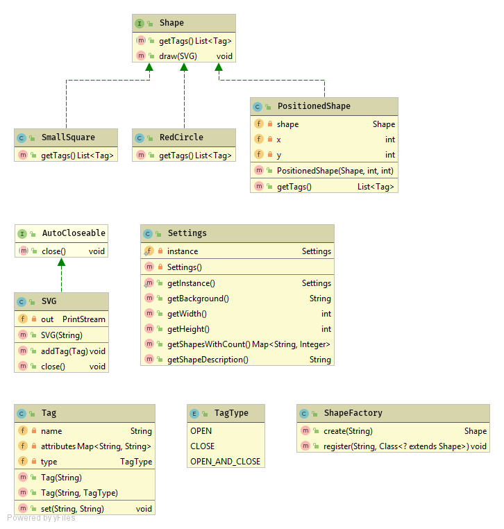

# Рисование SVG

Пример SVG изображения:
```svg
<svg xmlns="http://www.w3.org/2000/svg" width="200" height="200">
    <rect x="10" y="10" height="100" width="100" style="stroke:#ff0000; fill: #0000ff"/>
</svg>
```

[Справочник по элементам и атрибутам SVG](https://developer.mozilla.org/ru/docs/Web/SVG)

## Диаграмма классов
Это те классы, которые должны получиться в окончательной версии программы:


## Условие задачи

1. Вспомогательные классы для рисования
SVG
    1. Класс SVG, содержит открытый
    PrintStream для печати SVG:
    ```
    SVG svg = new SVG("a.svg", 300, 300);
    svg.addTag(rect1);
    svg.addTag(rect2);
    svg.close();
    ```
    В конце обязательно будет вызвано закрытие, чтобы закрыть PrintStream
    2. Класс Tag - это описание одного тега.
    ```
    Tag rect1 = new Tag("rect");
    rect1.set("x", "200");
    rect1.set("y", "200");
    rect1.set("width", "10");
    rect1.set("height", "20");
    rect1.set("style", "stroke:#ff0000; fill: #0000ff");
    ```
1. Когда сделаете классы Tag и SVG, проверьте, что вы можете создавть картинки с их помощью.
1. Измените код так, чтобы не требовалось вручную вызывать `close()` в классе SVG. Для этого класс SVG должен реализовать интерфейс
AutoClosable, и после этого класс можно будет использовать в конструкции try-with-resource:
    ```
    try (SVG svg = new SVG("a.svg", 300, 300)) {
        ...
    ```
1. Давайте реализуем еще вложенные теги. Нам это понадобиться, чтобы удобно двигать фигуры. Посмотрите на такой SVG, создайте эту
картинку и посмотрите, как она выглядит:
    ```svg
    <svg xmlns="http://www.w3.org/2000/svg" width="300" height="300">
        <rect x="10" y="10" height="100" width="100" style="stroke:#ff0000; fill: #0000ff"/>
        <rect x="20" y="20" height="100" width="100" style="stroke:#ff0000; fill: #00ff00"/>
        <g transform="translate(150, 150)">
            <rect x="10" y="10" height="100" width="100" style="stroke:#ff0000; fill: #0000ff"/>
            <rect x="20" y="20" height="100" width="100" style="stroke:#ff0000; fill: #00ff00"/>
        </g>
    </svg>
    ```
    
    В этом примере рисуются два прямоугольника друг на друге, а потом такие же два прямоугольника помещены в группу (тэг `g`),
    и этой группе указан атрибут `transform`, который говорит, что ее содержимое надо сместить на 150 пикселей по горизонтали
    и вертикали.
    
    Обратите внимание, что тэги `rect` открываются и сразу закрываются, об этом говорит слэш перед закрывающей угловой скобкой.
    А тэг `g` только открывается, у него нет слеша перед закрывающей угловой скобкой. Зато ниже этот тэг все же закрывается тегом,
    который начинается со слеша: `</g>`. Поэтому, предлагаю ввести три типа тэгов: открывающие, закрывающие и открывающие-закрывающие.
    Вот как можно описать три типа тэгов в Java с помощью нового для нас понятия `enum` (перечисление):
    
    ```java
    public enum TagType {
        OPEN, CLOSE, OPEN_AND_CLOSE;
    }
    ```
    
    `enum` задает тип данных, который может иметь только несколько возможных значений. Для ссылки на значения пишите `TagType.OPEN`,
    `TagType.Close` и т.п.
    
    Предлагаю создавать подобный SVG следующим образом:
    ```java
    Tag rect1 = new Tag("rect");
    //заполняем rect1 как первый квадрат
    Tag rect2 = new Tag("rect");
    //заполняем rect2 как второй квадрат
    Tag g = new Tag("g", TagType.OPEN);
    g.set("transform", "translate(150, 150)");
    Tag gClose = new Tag("g", TagType.Close);
    
    try (SVG svg = new SVG("a.svg", 300, 300)) {
        svg.addTag(rect1);
        svg.addTag(rect2);
        svg.addTag(g);
        svg.addTag(rect1);
        svg.addTag(rect2);
        svg.addTag(gClose);
    }
    ```
    
    Вам придется добавить еще один конструктор в класс `Tag`, в котором можно указать тип тэга.
    
1. Интерфейс Shape. Фигура. Изображение будет рисоваться из большого числа фигур. Какие имеено фигуры будут использоваться для рисования, будет задаваться в настройках. Этот интерфейс имеет метод getTags(), который возвращает список тегов `List<Tag>` для рисования этой фигуры. В этот же интерфейс можно (но не обязательно, сделайте это только если вам интересно попробовать неизученную раньше возможность java) поместить метод draw(SVG), который имеет реализацию по-умолчанию, и передает все свои теги в SVG для рисования:
```java
public interface Shape {

    List<Tag> getTags();

    default void draw(SVG svg) {
        //используйте getTags, чтобы получить тэги для фигуры и нарисовать их на svg.
    }
}
```
Сразу реализуйте этот интерфейс классами `SmallSquare` и `RedCircle`, они должны возвращать по одному тэгу, которые рисуют, соответственно, маленький квадрат и красный круг. Протестируйте создание фигур, для этого добавьте в main метод рисование фигур на SVG файл. Если вы реализовали метод `draw` внутри интерфейса `Shape`, то достаточно будет только вызвать его. Если не реализовали, реализуйте рисование фигуры прямо внутри метода `main`.

**Замечание о координатах фигур**. Рисуйте фигуры так, чтобы координата (0, 0) была примерно в середине фигуры. Реальное положение фигуры будет задаваться позже. Когда вы тестировали `SmallSquare` и `RedCircle`, вы, наверное, указали большие значения для коориднат фигур, чтобы они оказались ближе к центру изображения. После тестирования координаты надо исправить, чтобы центр фигуры оказался в (0, 0) или примерно в (0, 0).

1. Реализуйте класс `PositionedShape`, он содержит в себе информацию о фигуре и ее координатах. Такой класс позволит нам создавать много одинаковых фигур в разных местах изображения. Возьмите из диаграммы классов содержимое класса `PositionedShape` и реализуйте их. При реализации метода `getTags` необходимо вернуть закрывающий и открывающий теги `<g>` c атрибутом `transform`, а между ними вставить те теги, которые возвращает метод `getTags` для исходной фигуры. Другими словами, `PositionedShape` оборачивает теги исходной фигуры в тег `g` (в группу) и сдвигает эту группу.

Не забудьте протестировать созданный класс, для этого создайте несколько фигур `SmallSquare` и `RedCircle`, обернутых в `PositionedShape`, и сдвинутых в разные места изображения.
