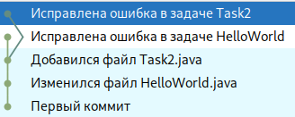
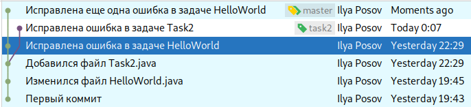

# Основы Git

## Предупреждение

Система контроля версий Git - это сложная программа, основанная
на сложных понятиях, и далеко не каждый программист хорошо в ней
разбирается. Тем не менее, ей или ее аналогами пользуются
все. Сейчас невозможно представить себе программирование
без систем контроля версий. Наша цель научиться пользоваться Git для выкладывания
решений своих задач. Нам потребуется только несколько простых сценариев
использования, поэтому я надеюсь, вы к ним быстро привыкнете и будете
считать git естественной частью процесса программирования.

Периодически вы будете сталкиваться со странными проблемами, из-за которых
у вас не будет получаться выложить решения, может потребоваться много времени,
чтобы разобраться. Обычно я помогаю с решением проблем в git, и, честно говоря, 
поэтому откладываю его изучение до конца — в начале при изучении
программирования и так достаточно разных трудностей для преодоления. Но сейчас
выбора нет, git наиболее удобен для того, чтобы я собирал ваши решения, иначе я
не справлюсь с потоком ваших решений в архивах, приложенных к письмам.  

Кроме git есть много других систем контроля версий, но сейчас именно
она является самой популярной. Она выиграла маркетинговую войну у
аналогов, даже более простых, удобный и быстрых, чем git.
Но мы всё равно будем учить то же, что учат и используют все — git. 

## Системы контроля версий

### История изменения файлов в каталоге

Системы контроля версий имеют много возможностей, мы начнем с такой:
они позволяют хранить историю изменения файлов в каталоге. Вот пример
такой истории, она читается снизу вверх:

Здесь у программиста был каталог, он наполнил его файлами и решил
запомнить это состояние каталога. Запоминание текущего состояния каталога
— это операция, которая называется "commit". Поэтому первое состояние
он назвал «первый коммит».

После этого программист внес изменения в файле HelloWorld.java и снова
сохранил состояние каталога — сделал коммит. Он прокомментировал
его как «Изменился файл HelloWorld.java». После этого он продолжил
изменять файлы в каталоге, сделав еще два коммита.  

Введем термины. **Коммит** — это операция, которую программист выполняет,
чтобы запомнить состояние каталога. (русский вариант термина: фиксация).
**Ревизия** — это состояние каталога, которое появляется после
коммита. Соответственно, на предыдущей картинке мы видим четыре ревизии,
которые получены с помощью четырех коммитов (операций фиксации). 

Система контроля версий позволяет перемещаться между ревизиями. Эта
операция имеет название — **чекаут (checkout)** (по-русски: извлечение).
После нее можно получить каталог таким, каким он был в прошлом.

Из-за возможности перемещаться в прошлое, история может стать
нелинейной:

Здесь исправление ошибки в задаче HelloWorld и
ошибки в задаче Task2 было сделано на основе
одной и той же ревизии. Т.е. после того, как программист исправил ошибку
в задаче HelloWorld, он вернул прошлую версию каталога — до исправления 
ошибки — и изменил каталог по-другому.

Мы будем стараться избегать нелинейной истории, хотя полностью этого сделать
невозможно.

Последнее понятие в этом разделе —  **ветки**. Ветка — это указатель
на ревизию:

Ветки видны на этой картинке в виде ярлычков, они называются master
и task2. Кстати, на этой же картинке видно, что про каждую
ревизию хранится дополнительная информация: это имя автора и время
создания.

Ветка может перемещаться при коммитах. Например, если вернуться
к ревизии, помеченной веткой master и снова сделать коммит, картина
станет следующей:

Здесь ветка master переместилась к последней ревизии.

При реальном использовании git обычно считается, что ветка master указывает
на ревизию с последней стабильной версией программы. Такую программу
можно запустить и использовать. А другие ветки
создаются для того, чтобы пытаться реализовывать в них новые возможности
для программы. Когда новая возможность реализована и протестирована,
ее можно совместить (слить) с основной веткой master.

Мы не планируем создавать ветки, у нас будет одна ветка master. 

### Репозитории

Репозиторий — это хранилище для ревизий. Если мы хотим пользоваться
системой контроля версий git, мы выбираем каталог, создаем (инициализируем)
в нём репозиторий, и дальше в этом репозитрии создаем ревизии.

Git называется распределенной системой контроля версий. Это означает,
что можно хранить программу в нескольких репозиториях:

На картинке видно несколько компьютеров: личный ноутбук студента,
компьютер в университете,
смартфон преподавателя, на котором он планирует проверять задачи, и
общедоступный сервер в Интернете. На всех этих компьютерах хранится
программный проект студента с решениями задач.

Как это происходит:

1. Студент решает задачи дома. Периодически делает коммиты в своем
репозитории на ноутбуке. Допустим, он сделал три коммита и получил,
соответственно, три ревизии.
1. После этого, отправляет эти три ревизии в репозиторий
