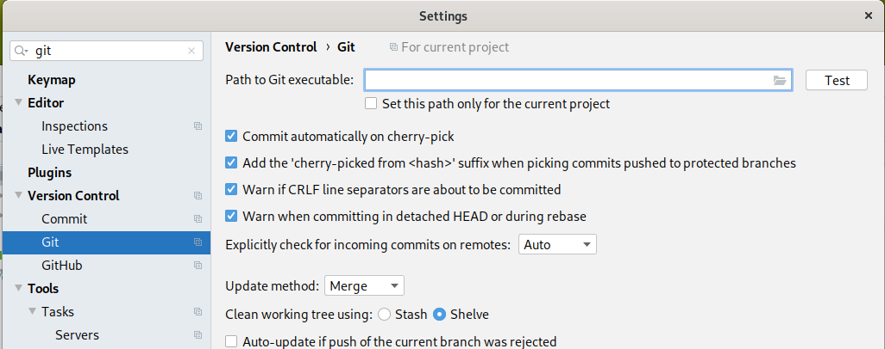

# Первая практика с git

Сначала убедимся, что IDEA может работать c git.

В диалоге настроек (File -> Settings) откройте пункт c git, для
этого я ввел git в поиске:

Если этого диалога нет, возможно, git не подключен. Маловероятно,
что это случится, но все равно проверьте в этом же диалоге
настроек пункт Plugins, чтобы убедиться, что плагин git
подключен.

В настройках git нас интересует верхний пункт Path to git executable.
Вы должны указать, где вы установили git. С некоторой вероятностью
IDEA нейдет git сама. Она тогда напишет, что он autodetected,
и вы можете нажать кнопку Test, чтобы проверить, что git
действительно обнаружен и работает.

Если не обнаружен, то нажимайте справа в поле ввода маленькую
кнопку browse и покажите каталог, где вы установили git. Внутри
нужно найти файл git.exe, он может быть в каталоге установки
или в подкаталоге bin. Обязательно нажмите Test в конце,
чтобы убедиться, что git работает.
