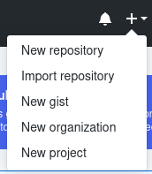
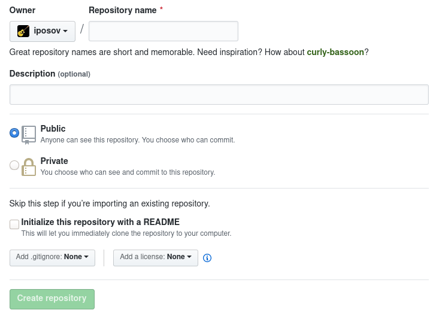
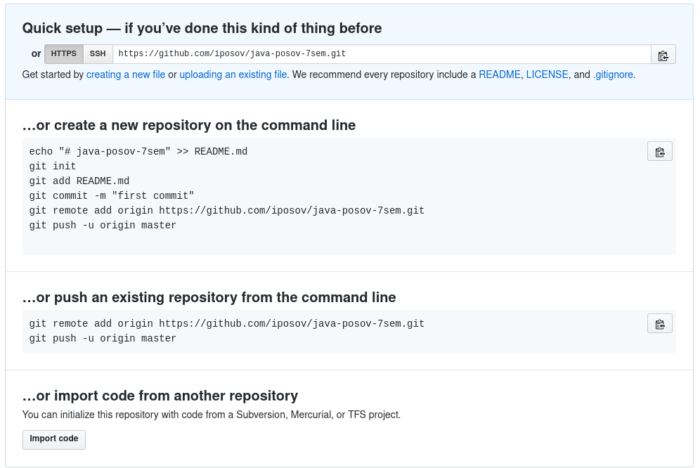
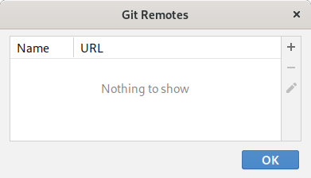
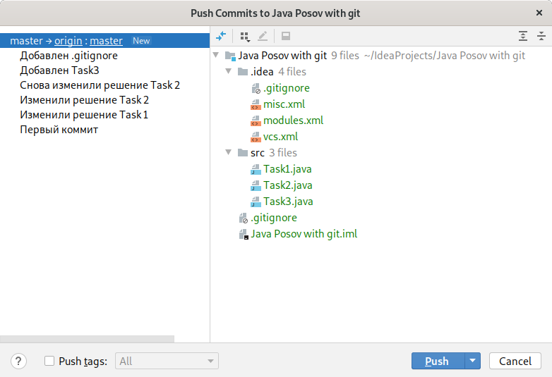

# GitHub

Будем считать, что сейчас у всех есть свой проект в git
репозитории. Наша задача выложить этот репозиторий на сайт
Github.

GitHub не случайно очень популярен. Это удобный сайт с
бесплатной возможностью создавать открытые репозитории.
У него очень много приятных возможностей, например, если у
вас в репозитории хранятся html, javascript, css файлы,
вы можете сделать из своего репозитория сайт. Получается,
GitHub работает как бесплатный хостинг для статических сайтов.
Именно так работает мой сайт для студентов, это всего лишь
веб версия репозитория https://github.com/iposov/students-site.
Для наполнения сайта мне достаточно только вносить изменения
в текст, коммитить их и проталкивать в GitHub с домашнего
компьютера. 

## Регистрация на github

Заходите на сайт [github.com](http://github.com), нажимайте
Sign Up справа сверху и регистрируйтесь. Регистрация достаточно
обычная, хотя требуется решать загадку с медведями.

Постарайтесь не забыть свой новый пароль. В качестве совета,
который вы не просили: я рекомендую пользоваться
программами-менеджерами паролей. В них можно придумывать
и хранить пароли для всех мест, где вы зарегистрированы.
Это не так удобно как использовать везде один пароль,
но значительно безопасней. Посмотрите на KeyPassXC или на
PasswordSafe.

## Создание репозитория.

После регистрации войдите в свой аккаунт и найдите справа
сверху плюсик:

Выберите New repository:

Введите название репозитория, что-нибудь типа java-posov-1sem.
Или воспользуйтесь предложенным ниже зеленым вариантом
для вдохновения.

Description — описание — можно не вводить.
Дальше вы должны выбрать, будет ли ваш репозиторий публичным,
т.е. сможет ли его читать любой человек в Интернете. Если 
стесняетесь — сделайте его приватным.

В следующем разделе про Readme, .gitignore и лицензию не выбирайте
ничего, это важно, иначе в репозитории сразу создадутся
выбранные файлы, появится одна ревизия, и вам будет
трудно совместить ваши ревизии с ревизией на github.

Если вы случайно все-таки выбрали добавить какие-то файлы
в свой новый репозиторий, проще будет создать репозиторий
заново.

Жмите Create Repository. И ваш новый репозиторий встречает вас
следующей информацией:

Тут предлагаются варианты, что вам делать дальше с пустым репозиторием,
вам достаточно скопировать ссылку сверху, которая выглядит
как https://github.com/iposov/java-posov-7sem.git, и дальше
мы этой ссылкой будем пользоваться из IDEA.

## Отправляем свой репозиторий на GitHub

В IDEA, меню VCS, пункт Git, внутри пункт remotes, будем
настраивать удаленные репозитории. Это те репозитории, с которыми
мы будем меняться ревизиями. Сюда нужно добавить наш новый
репозиторий на github:

 
 
 Пока здесь ничего нет. Нажмем плюс, оставим имя origin
 и введем ссылку, скопированную с GitHub:
 
 
 
 origin — это имя репозитория на GitHub. Дальше мы будем
 видеть это имя, и не будем видеть длинную ссылку. *По смыслу
 origin означает что-то типа "источник происхождения". Обычно
 репозиторий берется с GitHub, поэтому он и называется источник.
 Хотя у нас всё наоборот, и источником является наш компьютер.
 Но мы будем пользоваться стандартным называнием удаленного
 репозитория*. 
 
Теперь, наконец, пора проталкивать наш репозиторий на GitHub.

В меню VSC, пункт Git, внутри пункт Push (Ctrl + Shift + K):

В этом диалоге вы видете (выделено синим), что ваша ветка
master должна быть послана на Github (на origin) в
ветку origin:master, т.е. в ветку master удаленного репозитория.

Ниже перечислены все ревизии, которые нужно отослать.

Делайте Push, вводите пароль от GitHub, и если проталкивание
будет успешным, вы можете зайти на github, обновить страницу
с репозиторием, и вы увидете репозиторий, наполненный
файлами:

Над файлами видно, что это файлы из ветки master. Т.е. той
ревизии, на которую указывает ветка master. Фактически,
из последней ревизии.
