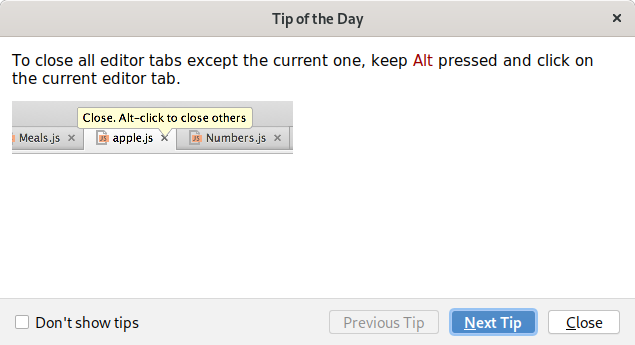
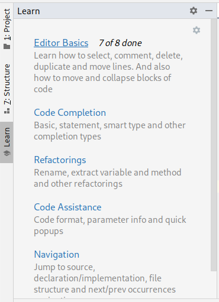

# Возможности среды разработки IDEA

Этот раздел я пока оставлю не дописанным, потому что, в принципе,
мы со всеми уже разбирали возможности при очных встречах. Я только
перечислю, что надо знать, и чем пользоваться. Некоторые из возможностей
знать надо обязательно, и они войдут в программу экзамена. Я выделил
эти возможности жирным шрифтом.

## Как IDEA сама помогает ее изучать

На самом деле, можно изучить IDEA с помощью ее самой, без всяких
учебников, документации и меня. Ниже я покажу, как это делать, проблема
одна — IDEA учит на английском. Это сложный язык, потому что он
очень не похож на русский. Но некоторые из вас его знают, а другие
могут воспользоваться поводом выучить. Тем более, что учить и привыкать
надо только к чтению технического английского, а не ко всему языку.

### Сочетания клавиш

Практически у всех элементов меню есть указание, какое сочетание
клавиш ему соответствует. Обращайте на них внимание и запоминайте,
если часто пользуетесь возможностью.

### Поиск везде

Shift + Shift

Появляется поиск по всему. Вашему проекту, пунктам меню, файлам,
настройкам.
Находите нужные вам действия и при необходимости запоминайте сочетания
клавиш для действий, или где эти действия расположены.

### Startup tips

При каждом запуске IDEA появляется окно с каким-то одним советом по
использованию. Например:

 
 
 Я рекомендую читать эти советы и пробовать, что там написано,
 если вы поняли. Если не поняли, либо прочитайте следующий совет,
 либо просто пропустите — прочитаете в другой раз.

## Плагин IDE Features Trainer

Хороший способ познакомиться со средой разработки — это плагин
IDE Features Trainer. Вы, возможно, его уже подключили при первом
запуске IDEA, я писал о нем. Если нет, включите его в настройках
и перезагрузите IDEA:

Здесь я открыл диалог Settings, выбрал раздел Plugins и ввел в поиске
слово features, чтобы найти этот плагин.

После перезапуска IDEA вы увидите доступ к плагину слева:

Нужно нажать на кнопку Learn, чтобы запустить изучение. Делайте, что
вам говорят, и запоминайте те возможности, которые нравятся.

## Productivity guide

Это возможность, которую очень рекомендуют разработчики IDEA. Найдите
в меню Help раздел Productivity Guide, вы увидите вот такое окно:

 

Здесь перечислены возможности IDEA, их описание, и высчитано, сколько
раз какой возможностью вы пользовались. Например, на изображении я
выбрал возможность стирания строки (Ctrl + Y), видно, что я
пользовался ей три раза. Заглядывайте сюда в минуты прокрастинации,
чтобы узнать еще о какой-нибудь полезной возможности.

## Переключение окон

Частая ситуация — нужно открыть какое-то окно, которого сейчас нет на экране.
Например, окно проекта, со списком файлов. Или окно Run с запуском
программы. Вы можете воспользоваться маленькой кнопкой в левом нижнем
углу для того, чтобы скрыть и показать кнопки окон.

Либо нажимайте
Ctrl + Tab для вызова диалога переключения окна, продолжайте нажимать
Ctrl + Tab (или Ctrl + Shift + Tab) для выбора нужного окна:

## Ошибки и предупреждения

В этой небольшой программке есть ошибки — подчеркнутое красным несоответствие
типов и предупреждения: неиспользованные переменные x и y, деление на
ноль.

Эти же ошибки и предупреждения обозначены справа в виде красных и оранжевых
линий. Справа сверху виден восклицательный знак, который означает, что
в программе есть ошибки. Все элементы активны, на них можно навести
мышь, курсор, увидеть пояснение и что-нибудь сделать.

**Важно** вы должны избавляться в своих программах от всех ошибок и
предупреждений. Изредка встречаются предупреждения, которые 
не имеют значения для вашей программы, в этом случае вы должны их либо
подавить (мы обсуждали, как), либо перенастроить, либо посоветоваться
со мной.

## Контекстные действия, намеренья

Лампочка, возникающая слева от кода. Нажимается либо мышкой, либо 
Alt + Enter.

Здесь я поставил курсор на ошибку с неверным типом. Нажал 
на лампочку слева и увидел варианты: изменить тип на String,
превратить строку в число с помощью метода Integer.parseInt().

Здесь есть и действия, не связанные с ошибкой, такие действия
всегда могут быть полезны. Например, скопировать содержимое текстовой
строки в буфер или разделить строку на определение переменной и
присваивание: `int x; x = "hello"`.

Сочетание **Alt + Enter** нужно знать обязательно. 

## Шаблоны

Стандартные куски кода можно вводить сокращенно. Вводите название,
а потом жмите Tab (или Enter, если появится выпадающий список
вариантов):

Вот, например, Как работает шаблон `psvm`:

**Знать обязательно** шаблоны `psvm`, `iter`, `itar`, `sout`, `soutv`.

Полный список шаблонов можно получить, нажав Ctrl + J.

## Автоматическое дополнение

Когда вы пишете код, автоматически появляется выпадающий список вариантов
продолжения кода. Пользуйтесь им, выбирая нужные варианты. Чем больше вы
напишете букв, тем меньше будет вариантов. Нажимайте вверх и вниз
для выбора варианта, потом Enter для применения. Читайте подсказки
внизу окна автодополнения, там иногда объясняется, что еще можно
делать с автодополнением.

Полезное знание, см. картинку. Если вы хотите написать `PrintStream`,
вы можете написать только начальные буквы обоих слов, например, `PrS`
или `PStr`.

**Знать обязательно**. Вызов автодополнения, если оно не появилось само,
это Ctlr + Space.

Полезно знать еще Ctrl + Shift + Space, которое умнее, и само
фильтрует варианты, догадываясь по контексту, что вы хотите написать.
 
Про другие варианты автодополнения вы узнаете из подсказок.

## Рефакторинг

Это важный раздел, но его я не буду писать подробно. Вспоминайте
содержание пар.

**Знать обязательно** рефакторинг переименовывания переменных,
классов, файлов и чего угодно: Shift + F6.

Рекомендуется знать еще и рефакторинги выделения (extract ...), в
первую очередь выделения переменной (Ctrl + Alt + V). Список
рефакторингов есть в меню, там же для них записаны сочетания клавиш.

## Отладка

Запуск в режиме отладки. Возможно, наполним раздел позже, с кем-то
мы отладку уже разбирали.

## Другие важные возможности

Обязательно нужно знать:

1. **Ctrl + Y — удаление строки** 
1. **Ctrl + Q — контекстная помощь (quick documentation).
Поставьте курсор на любой метод, класс,
или выберите вариант в списке автодополнения, нажмите Ctlr + Q и прочитайте
помощь по элементу**. Этот пункт такой важный, что я даже узнал,
как он вызывается на Mac: это F1:

    
    
    Здесь курсор находился на методе `parseInt`, появилась помощь. 
    В ней написано, что делает метод, какие ему нужно передать 
    параметры, что он возвращает, и какие исключения могут возникнуть
    при работе этого метода.
1. **Ctrl + P — помощь по списку аргументов метода. Если курсор
находится внутри скобок с перечислением параметров метода, Ctrl + P
покажет, какие аргументы писать**. Часто эта подсказка появляется
автоматически, когда вы вызываете метод. Но если нет, жмите Ctrl + P.

    
    
    Здесь в подсказке видно, что есть три варианта вызова метода `parseInt`,
    можно написать только строку (последний вариант), можно строку и 
    систему счисления (первый вариант), а еще можно строку, начальный,
    конечный индекс и систему счисления (второй вариант).
1. Перемещения курсора. Это важно знать, и это работает не только в IDEA.
   1. **Стрелки вверх, вниз, вправо, влево.** Они двигают курсор по тексту,
   это знают все.
   1. **Кнопки Home и End**, найдите их на клавиатуре. Перемещают
   курсор, соответственно, в начало и конец строки. Если в начале
   или конце строки несколько пробелов, то Home и End можно
   нажать несколько раз, чтобы переместиться до или после пробелов
   (попробуйте).
   1. **Если при движении влево или вправо зажимать Ctrl, то
   перемещение происходит по словам**. Попробуйте Ctrl + влево или
   Ctrl + вправо.
   1. **Если при движении зажимать Shift, то происходит выделение.**
   Попробуйте Shift + End, Shift + Ctrl + влево. Shift + вниз.   

### Полезно знать еще: 

1. Ctrl + N — поиск класса по имени. Еще есть Ctrl + Shift + N —
поиск файла по имени. Или Ctrl + Alt + Shift + N — поиск любой
функции или переменной по имени.
1. Ctrl + B или Ctrl + левая кнопка мыши. Переход к определению
метода или переменной, тому месту где она введена.
1. Ctrl + Shift + I — просмотр определения переменной или метода во 
всплывающем окне.
1. Ctrl + Shift + Up или Down — перемещение строки, или целой функции
вверх и вниз.
1. Ctrl + D — дублирование строки.
