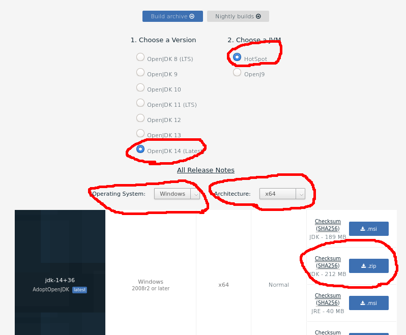
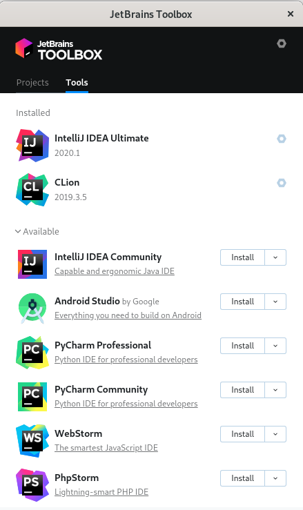
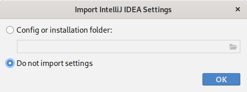
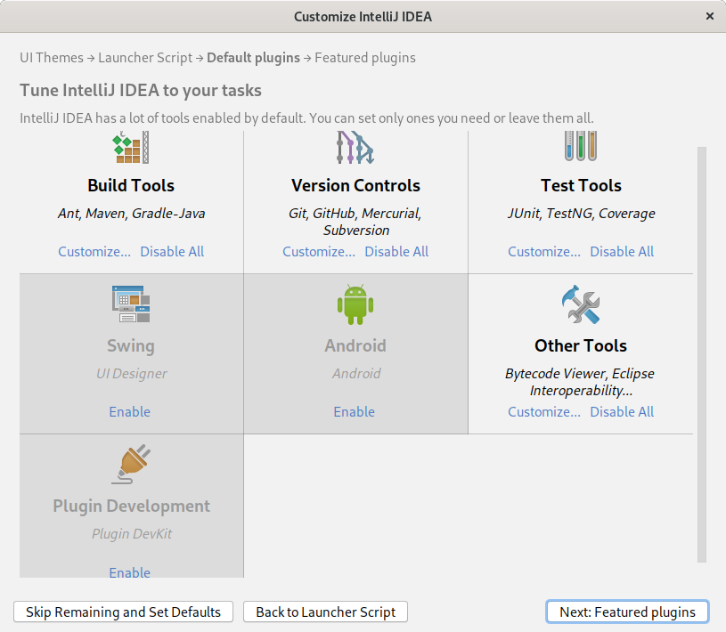
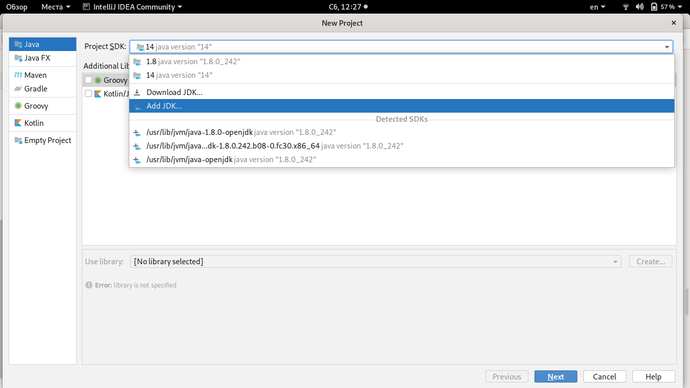
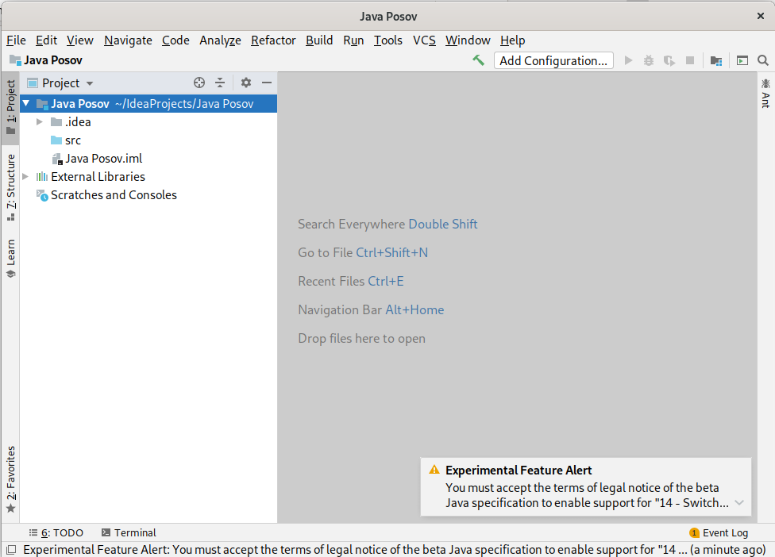
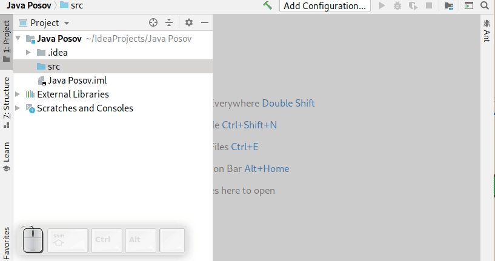

# Установка среды разработки IntelliJ IDEA и Java

## Сначала Java

Вышла новая Java 14 версии. Это версия с длительной 
поддержкой, поэтому имеет смысл обновиться. Загрузите себе
эту версию.

1. [https://adoptopenjdk.net](https://adoptopenjdk.net)
1. Выбирайте "Other platforms", чтобы загрузить архив
1. Версия Open JDK 14, JVM: HotSpot
1. Выберите свою операционную систему, например, windows
и архитектуру, скорее всего у вас x64.
1. В списке снизу выберите вариант JDK (Java вместе с инструментами
разработки) и zip архив.  



Раскройте архив в какое-то место, которое вы будете знать. У себя на линукс я сделал папку opt в домашней
директрии. /home/ilya/opt/jdk-14+36. Вы можете раскрыть в `C:\Program Files\jdk-14+36`.

На первых парах мы учились пользоваться Java без дополнительных инструментов, нам было достаточно
только этого скаченного архива. Сейчас мы установим среду разработки, которая значительно упростит работу
и даст много полезных возможностей.

## IntelliJ IDEA

IntelliJ IDEA от фирмы JetBrains - интеллектуальная среда разработки, она понимает код, который вы пишете,
подсказывает, что
нужно написать дальше и дает содержательные советы по тому коду, который уже написан. Профессиональные 
разработчики обязательно пользуются средой разработки.
Я прошу использовать для работы именно IntelliJ IDEA, а не другие среды разработки (Eclipse, NetBeans из
самых распространенных) и тем более не другие текстовые редакторы, даже продвинутые (Atom, Sublime и т.п.)

IDEA можно установить напрямую, но я прошу так не делать. Это усложнит ее обновление, вам придется периодически
загружать новую версию вручную. Лучше воспользоваться программой [Jetbrains Toolbox](https://www.jetbrains.com/toolbox-app/),
загрузите ее, установите, запустите, вы увидите что-то наподобие:



1. Справа сверху найдите шестеренку с настройками всей программы и уберите внутри "Run at login", чтобы программа
не запускалась сама при старте. Закройте настройки
1. Найдите в списке "IntelliJ IDEA Community" и установите ее кнопкой Install.
1. Вы можете установить Ultimate версию вместо Community. В Ultimate больше возможностей, некоторые из них
полезны, но эта версия имеет больший размер и в ней больше пунктов меню, поэтому она может пугать своим
перегруженным внешним видом. Кроме того, для версии Ultimate вам придется получить на сайте
jetbrains студенческую лицензию, чтобы пользоваться IDEA бесплатно.
1. При необходимости обновить среду разработки в будущем, открывайте toolbox и нажимайте "upgrade".

## Первый запуск IDEA

Запускайте IDEA через программу Toolbox или, как обычно, из списка установленных
программ.

При первом запуске вы увидите окно



которое спрашивает, настраивать IDEA с нуля, или можно взять какие-то старые настройки. Скорее всего,
старых настроек нет, поэтому выбирайте "do not import settings".

Далее, выбирайте темную или светлую тему оформления, пропускайте экраны, пока не увидите окно выбора
плагинов:



В нем отключите плагины, как я показал на картинке. Плагины лучше отключать, потому что, чем их больше,
тем дольше запускаетcя IDEA, и тем больше разных отвлекающих пунктов в меню. 

На следующем окне тоже выбор плагинов, из них, возможно, вас заинтересуют EduTools. Кроме того,
первый позволяет интегрироваться со Stepik для решения задач, второй я настоятельно рекомендую для
для изучения возможностей среды.

## Создание проекта

Настройка закончена, после запуска IDEA вы увидите:


Нажимайте `Create New Project` для создания нового проекта. Если у вас не будет начального окна, как сейчас,
создать новый проект всегда можно через меню `File`.

Первым делом вы должны выбрать Java (JDK), которой
будете пользоваться. Вспомните, что мы ее скачивали и разархивировали в какой-то каталог, который вы должны
были запомнить. Если не запомнили, ищите или скачивайте JDK еще раз. Ниже видно, куда нажать (`Add JDK`),
чтобы добавить свой JDK, если его нет в списке:



Пропускайте экраны, пока не увидите самый важный экран создания проекта про его расположение и название:


Придумайте название проекту. Там вы можете написать номер семестра, слово Java, еще какие-то логичные
слова. После этого выбирайте расположение. Это папка, в которой будет находиться ваш проект. Важно:

1. Вы должны сознательно выбрать эту папку и знать, где она находится. Потом вам потребуется находить
ее на диске, копировать куда-нибудь для сохранности, архивировать, чтобы отправить преподавателю и т.п.
1. Либо создайте новую папку, либо выберите папку, в которой вы решали задачи. Там у вас java и bat файлы.
1. Если вы когда-нибудь в будущем будете открывать свой проект, выбирайте для открытия ровно ту же папку,
которую вы указали при создании проекта. Это очень частая ошибка, при открытии проекта указать какую-то
подпапку, проект при этом открывается, но выглядит странно и не работает.

Нажимайте Finish и встречайте свой новый проект:



Слева видны файлы проекта. Если не видны, нажмите слева на кнопку "1: Project" или нажмите `Alt + 1`.

## Проверка, что проект работает

Давайте убедимся, что проект работает. Нажмите правой кнопкой на каталог `src`, выберите New, потом Java Class:



Введите программу

```java
public class HelloWorld {
    public static void main(String[] args){
        System.out.println("Hello World!");
    }
}
```

и нажмите зеленый треугольник слева от метода `main`. Нужен первый вариант, `Run HelloWorld.main()`.


После первого запуска программы вы увидите снизу результат запуска, и еще один зеленый треугольник слева, который
тоже позволяет запускать программу.
