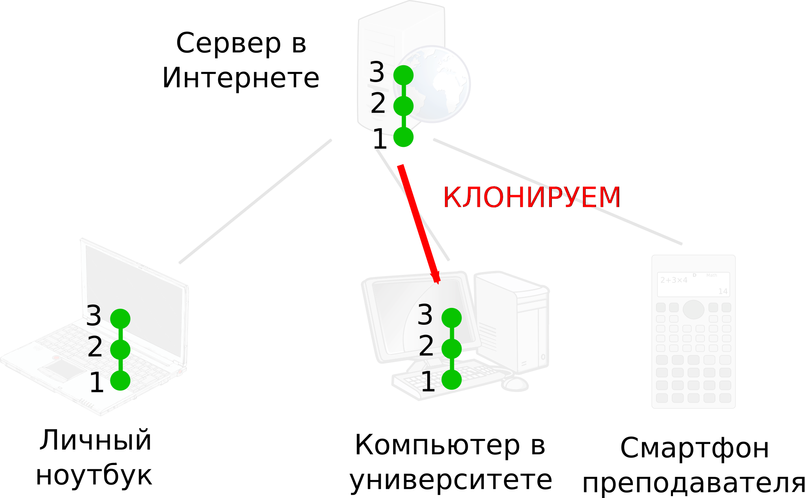
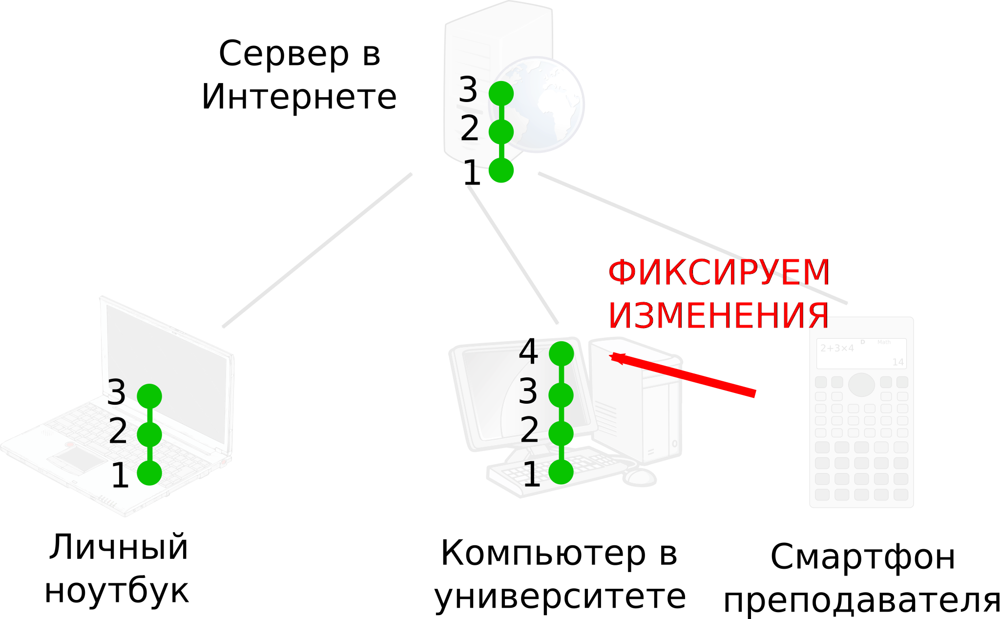
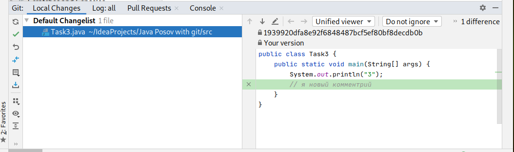
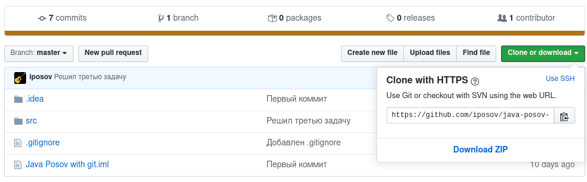
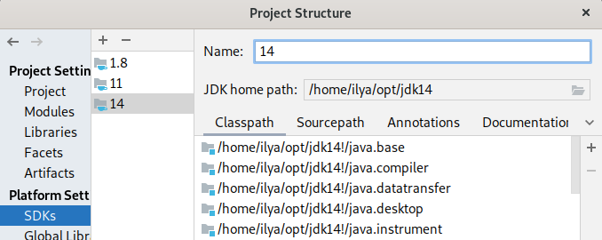
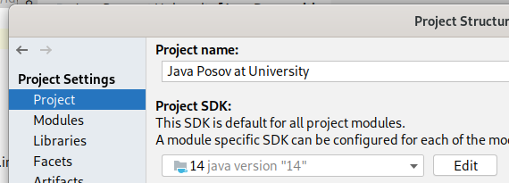
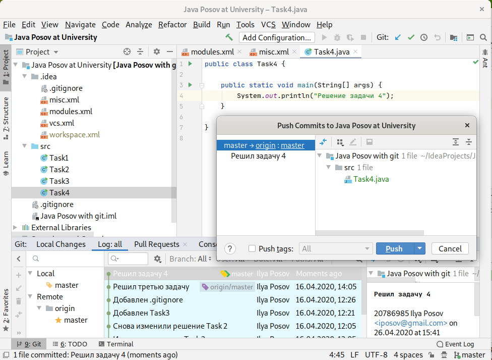
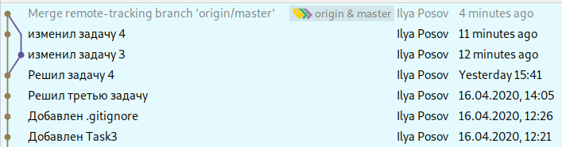
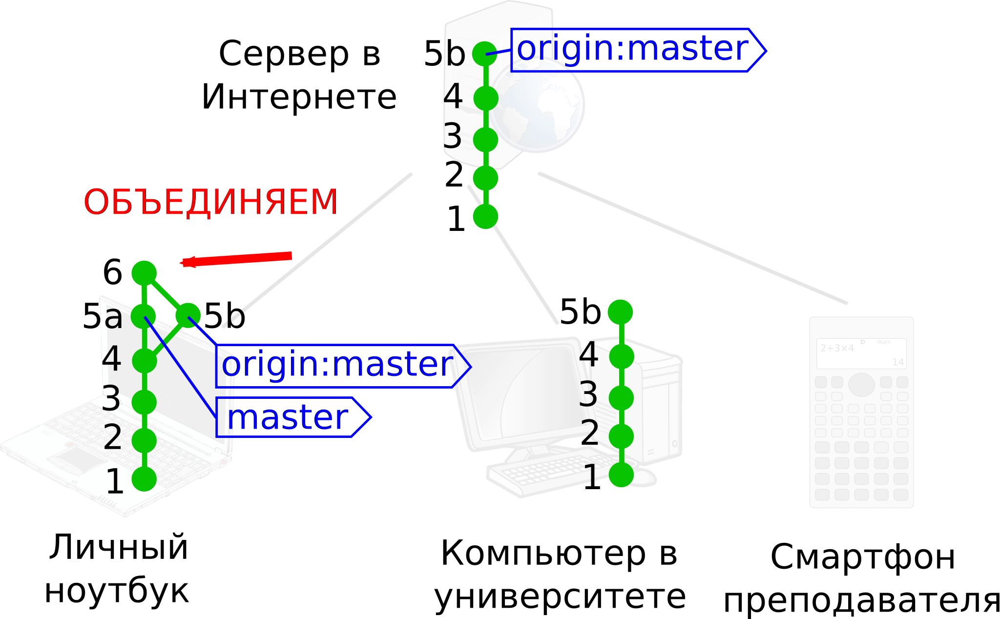
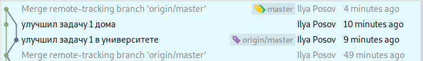

# Несколько клонов репозитория

На данный момент у нас есть локальный репозиторий
с проектом на нашем компьютере и репозиторий
на GitHub. Мы решаем задачи на компьютере, фиксируем (commit) изменения, получаем
ревизии и периодически отсылаем их в репозиторий на GitHub.

## План действий по клонированию репозитория

Давайте так. При первом прочтении всего, что будет дальше, не делайте сами никаких действий. Прочитайте,
посмотрите картинки, поймите, что происходит, после этого вернитесь и повторяйте. Действий я предлагаю
сделать немного, они не очень сложны для понимания, но трудность в том, что если вы случайно сделаете
что-то не так как у меня, git начнет вести себя по-другому, и вам будет трудно
продолжать за мной повторять. Вы вряд ли что-то сломаете необратимо,
с git очень трудно что-то сломать, особенно пока вы работаете самостоятельно.
Вся история действий хранится, и всегда можно откатиться к прошлому состоянию репозитория.
Проблема в том, что мне трудно помогать вам удалённо. 

Итак, что мы собираемся сделать на первом этапе:
1. Убедимся, что локальный домашний репозиторий и репозиторий на GitHub полностью совпадают. Ревизия в ревизию,
символ в символ.
1. Создадим клон репозитория в новом месте. Как будто на компьютере в университете, на самом деле в другом
каталоге.
1. Проверим настройки проекта, чтобы клонированный проект работал нормально в IDEA.
1. Сделаем изменения "в университете" и пошлем их на GitHub.
1. Получим изменения с GitHub обратно в "домашний" репозиторий.

Вот примерно так это будет выглядеть:

Как видите, работа с Git это работа по перемещению зеленых кружочков между компьютерами. Дальше
я напишу очень много текста про перемещение кружочков, прошу не пугаться, это не значит, что
нужно будет нажимать много кнопок. Наоборот, кнопок очень мало, просто важно нажимать их вовремя и знать
что делать, если что-то пошло не так. 

# Убеждаемся, что состояние локального репозитория и репозитория на GitHub идентичны
Надо убедиться в двух вещах: что у вас нет никаких
незафиксированных изменений, и что все ваши ревизии загружены
на GitHub.

Что случится, если вы **не** убедитесь? Мы собираемся сделать
еще одну копию репозитория и делать изменения в ней. Если у вас будут изменения
и в исходной копии, и в новой, нам будет сложно их совмещать.
Мы позже научимся совмещать изменения из разных мест, потому что это как раз то, для
чего нужна система контроля версий, но пока давайте упростим себе жизнь и не будем
совмещать изменения, сделанные в разных местах. 

По порядку. Есть ли незафиксированные изменения? Возможно, вы написали код, 
который забыли зафиксирвать (commit). Или просто случайно набрали какие-то лишние
символы в коде. Для проверки откройте в окне Git
вкладку Local Changes. Если там перечислены какие-то файлы, то это файлы
с изменениями. Вам нужно либо сделать коммит, чтобы всё зафиксировать,
либо нужно отменить все изменения.

В примере ниже видно, что изменен один файл:

Допустим, мы хотим отменить в нем все изменения. Если нажать на файл, можно
увидеть справа, что именно изменилось в файле
с последнего коммита. Или если окно справа для вас слишком маленькое, нажмите два раза
на файл, он откроется в редакторе, и там вы увидите с помощью пометок слева от кода, что именно изменилось.
На каждую пометку можно нажать и вернуть всё как было.

Другой вариант отмены изменений — операция Rollback. Нажмите правой кнопкой на любом файле или
даже каталоге, выберите Rollback
(или, в зависимости от меню, сначала Git потом Rollback),
тогда в файле или каталоге полностью отменятся все изменения.

Когда список измененных файлов станет пустым, убедитесь, что все ревизии отосланы
на GitHub. Для этого просто сделайте Push.

Итак, **перед тем как идти дальше, убедитесь, что у вас нет незафиксированных 
изменений, и все
ревизии с локального компьютера отправлены на GitHub. Это значит, что
ваша копия репозитория и копия на GitHub абсолютно одинаковы**.
Чтобы еще раз гарантированно убедиться, сделайте
Push и проверьте, что больше на GitHub новые ревизии не отправляются.

## Клонирование репозитория

Давайте получим копию репозитория еще на одном компьютере. Как будто бы мы пришли
в университет, а личный ноутбук остался дома. Так как на самом деле мы не можем
сейчас идти в университет, вместо другого компьютера сделаем клон репозитория
в другом каталоге. У вас будет два каталога с одним и тем же проектом.
Если у вас дома два компьютера, можете попробовать проделать всё на другом. Не забудьте только
установить там, Java, Git, Jetbrains Toolbox, Idea. И настроить их.

Выберите в меню VCS пункт "Get From Version Control...":

Выберите, что вы пользуетесь Git, потом введите URL своего репозитория.
Его можно найти
на сайте GitHub, если нажать на зеленую кнопку "Clone or download":

В конце введите каталог, куда скачается проект. Отнеситесь серьезно к выбору каталога, чтобы не
запутаться потом, в каком каталоге у вас исходный проект, а в каком — новый клонированный с GitHub.
Я, как видно, назвал новый каталог "Java Posov at University", как будто бы это каталог
на компьютере в Университете.

На картинке ниже виден клонированный проект, он состоит из тех же файлов, что и исходный,
в журнале (log) Git видны те же ревизии. От исходного проекта новый можно отличить только заголовком окна:

## Возможные проблемы с проектом после клонирования

Если вы клонируете проект на тот же компьютер, на котором
его создали, скорее всего проект заработает сразу.
Если вы клонируете на другом компьютере, возможно,
придется поправить настройки проекта. О настройках
IDEA у нас есть отдельная глава.

Вероятней всего, собьется настройка SDK, это настройка о том, из какого каталога
брать установленную Java. Ясно, что на разных компьютерах Java установлена в разные каталоги.
Настройка SDK находится в диалоге Project Structure, и, скорее всего, IDEA сама
вам ее откроет, когда поймет, что с SDK какие-то проблемы:

Видно, что у меня настроены несколько SDK, для Java версий 14, 11 и 1.8. Выбрана
SDK с названием 14, и для нее установлен каталог /home/ilya/opt/jdk14.
Название для SDK я написал специально такое простое "14", чтобы я мог сделать SDK
с тем же названием на другом компьютере. Но на другом компьютере я укажу другой
каталог, где установлена Java.

Зачем это всё? IDEA хранит для проекта не сам каталог, а имя SDK. Т.е. в каталоге .idea, который 
хранится в репозитории, записано, что вы пользуетесь SDK с именем, например, "14".
И, когда вы клонируете проект на другом компьютере, он получит тот же каталог .idea, а следовательно
и тот же SDK с названием 14. Следующий рисунок напоминает, где выбирать SDK для проекта:

## Изменяем что-нибудь в проекте в Университете

На компьютере в университете ... Постоянно проверяйте, где вы выполняете действия, откройте два окна
с IDEA проектами, домашнем и университетским, и постоянно смотрите на заголовок... так вот, на компьютере в
Университете сделайте какие-нибудь изменения, например, создайте
класс `Task4`, как будто вы решаете еще одну задачу, потом сделайте commit с этим файлом и push на GitHub:

Здесь показано, как выглядит интерфейс за секунду до Push на GitHub. В редакторе открыт новый класс,
снизу в журнале видно, что уже создана новая ревизия с комментарием "Решил новую задачу". На эту
ревизию ссылается ветка `master`, а ветка `origin:master` ссылается на предыдущую ревизию. Напомню, 
что `origin` — это репозиторий на GitHub. В прошлый раз мы настраивали имя `origin` вручную, а в этом
репозитории `origin` автоматически ссылается на GitHub потому что это именно то место, с которого мы
этот репозитрий клонировали.

В общем, когда мы нажмем на Push, новая ревизия отправится на GitHub. Ветка `origin:master`
тоже переместится на новую ревизию. Если вы откроете в браузере свой репозиторий на GitHub,
сможете убедиться, что там появилась новая ревизия с решением четвертой задачи.

## Обновление проекта

Пора вернуться домой, открыть домашний проект, с которого мы начинали, и попытаться забрать новую
ревизию с GitHub.

Очередной раз убедитесь, что у вас нет никаких изменений в файлах после последнего коммита. Откатите
все изменения, если они есть: вручную или через rollback. **Тем более не фиксируйте сейчас
новых изменений**. Список локальных изменений (Local Changes)
должен быть пустым. **Пусть у вас появится привычка убеждаться перед обновлением, что в репозитории
нет локальных изменений**. Это не значит, что их нельзя иметь, но вам придется
договариваться с IDEA, что с ними делать: сохранить отдельно, совместить с проектом после обновления.
На данном этапе проще не иметь изменений и не думать о них.

Получить в IDEA новую ревизию GitHub можно большим количеством способов, и они
могут дать разный результат. В этом месте git
сложнее других систем контроля версий. Лучше бы мы изучали Mercurial. К счастью, в IDEA
есть операция Update (обновить), которая универсальна для всех систем контроля версий.
Она делает ровно то, что нам нужно, обновляет проект до последней версии со всеми ревизиями.
Я прошу пользоваться именно операцией Update. В конце я покажу, как делать обновление
самостоятельно, но сейчас пусть всё будет просто.

В меню VCS выбираем Update Project... или нажимаем на кнопку с синей стрелкой в панели инструментов:

Убедитесь, что выбран вариант Merge. Если хватит сил, мы обязательно
обсудим, что бы
случилось в случае rebase, потому что этот вариант по моим наблюдениям
более популярен. Но Merge проще для понимания и честнее, потому что 
не изменяет историю репозитория.
После нажатия Ok. Проект обновится. Вероятно, вы увидите что-то
подобное справа снизу:

Т.е. что обновился один файл из одного коммита. Это файл Task4.java,
который мы создали "в Университете".

Вот и всё. Так просто. Проверьте, что изменения "из университета"
действительно появились. Секрет простоты в том, что сначала
все репозитории были одинаковые, а потом изменения были сделаны
только в университете и легко распространились на остальные
репозитории. Что происходит, если изменения
сделаны в двух местах, мы узнаем в следующем разделе. Там же
мы узнаем, что Update скрывает в себе несколько действий:
Fetch + Merge + Commit + Checkout. Все эти действия тихо и незаметно
для нас были проделаны IDEA.

## Делаем изменения и дома, и в Университете

Если вы все делали, как я описывал, то и дома, и в Университете,
и на GitHub вы имеете одинаковые репозитории. Так вот, в домашнем
проекте и в проекте в университете измените по одному файлу.
**Только измените обязательно разные файлы**. Иначе git
будет спрашивать, что делать при объединении двух вариантов
одного файла, избежим пока этого:

Протолкнем (push) изменения из Университета на GitHub:

Протолкнем (push) изменения из дома на GitHub. Заметим, что
при этом образуется ошибка:

Ошибка говорит, что мы не можем проталкивать в удаленный репозиторий
изменения, если уже есть какие-то другие изменения из других
мест.

У нас два пути:
1. Нажать Merge.
1. Нажать отмену, сделать Update (см. прошлый раздел) 
и потом снова Push

Первый путь, конечно, проще, одна кнопка вместо двух действий. Давайте
так и сделаем. Все должно пройти гладко, вы увидите в журнале
следующую историю изменений:

Она означает, что после ревизии "Решил задачу 4" было два
независимых изменения, которые потом слились в новую ревизию.
Новая ревизия с комментарием "Merge remte-tracking branch 'origin/master'"
объединяет в себе оба изменения. Судя по тому, где нарисована
ветка `origin:master`, эта ревизия уже есть на GitHub.

Вот что на самом деле произошло от одной кнопки Merge.
Она не сделала Push, она начала с операции Update. Сначала
были затянуты (эта опрерация называется Fetch) изменения с GitHub:

Вторая картинка добавляет информацию о том, куда указывают ветки.
`master` это ветка на нашем домашнем компьютере, `origin:master` —
в GitHub.

Дальше произошло объединение двух ревизий в одну, эт та
самая операция Merge. На этом этапе довольно много всего 
может пойти не так, если git не понимает, как совместить
два набора изменений. Но мы делали изменения в разных
файлах, чтобы точно не было конфликтов изменений во время
Merge:

Теперь нужно извлечь в рабочую директорию новую ревизию.
6-ую на картинке. Потому что до этого там была 5. При этом
двигается ветка master.
Такая операция извлечения другой ревизии в рабочую директорию,
где вы пользуетесь файлами, называется check out (извлечение):

И вот теперь мы видим в нашем рабочем каталоге все изменения.
Фактически, совершена операция Update. Давайте вспомним, что мы
делали. Update = Получить новые ревизии из удаленного
 репозитория (Fetch) + Объединить наши и чужие изменения (Merge) +
 + Зафиксировать новую объединенную ревизию (Commit) +
 Checkout (извлечь новую только что объединенную ревизию в рабочую
 директорию, это ту, где мы видим наши файлы).

Но мы же начали с того, что хотели сделать Push. И вот этот 
Push тоже был уже сделан:

Вот так много всего мы проделали, нажав одну кнопку.

В конце неплохо бы затянуть новые ревизии в репозитории в
Университете. Откройте этот проект и сделайте Update:

Опять Update = Fetch + Merge (нечего совмещать, поэтому
этот шаг пропускается) + Checkout.

Теперь мы снова имеем одинаковые репозитории во всех трех местах.

## А что если мы изменим один и тот же файл?

Давайте проделаем все действия, что и в прошлом разделе, но
изменим один файл. Желательно еще и в той же строке.

Когда вы будете выполнять действия из прошлого раздела, вы нажмете
Merge, и в этот раз всё пройдет не так гладко. Появится окно:

В нем видно, что есть конфликтующий файл Task1.java. Выше видно содержимое этого файла, оно стало испорченным,
там появились оба изменения с пометками, откуда они пришли. Не пугайтесь этого, IDEA починит за вас файл.
Вы видите три варианта, что можно нажать: оставить свою версию этого файла, т.е. выкинуть изменения, сделанные
в университете (Accept Yours), можно наоборот принять только чужие изменения из
Университета (Accept Theirs), или можно вручную совместить, жмите Merge:

Слева вы видите свою версию, справа — из Университета. А в середине вы должны 
написать новую версию, результат объединения. Напишите там, что-нибудь
и жмите Apply. Подтвердите, что вы разрешили конфликт, после чего вы увидите
в журнале ревизию, объединяющую две предыдущие. Если не увидите, сделайте
коммит:

## Удачи с Git

Кстати, если вы делаете какие-то изменения в репозитории
на GitHub, это тоже считается за создание новых ревизий,
и вам придется делать всё описанное в этом тексте,
чтобы получить изменения оттуда себе на компьютер.
