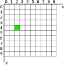
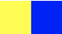

# Растровые изображения

Будем рисовать с помощью Java изображения. Причем,
разберемся, как можно редактировать изображения попиксельно,
т.е. изменяя цвет каждого пикселя отдельно. Нас не будет интересовать ничего
кроме изменения отдельных пикселей, в частности, мы не будем обсуждать,
как рисовать линии, окружности, кривые и другие примитивы. Хотя в JavaFX можно
рисовать не хуже, чем мы рисовали на HTML Canvas на курсе компьютерной графики.

## Класс `Image`

Здесь и далее мы будем обсуждать классы только из пакетов javafx. Будьте
внимательны при импортировании класса, убедитесь, что вы **не** подключаете
классы из других пакетов. Например, подключайте `javafx.scene.image.Image`,
а не `java.awt.Image` и тем более не `com.sun.prism.Image`. Из `com.sun` вообще
никогда ничего не подключайте.

Класс `Image` хранит информацию о содержимом изображения и умеет загружать
изображения с диска или из Интернета. Посмотрите, какие конструкторы есть
у этого класса:
```
new Image()
```
Напомню, что вы можете поставить курсор внутрь скобок и нажать `Ctrl + P`,
тогда вы увидите, что можно указать для создания изображения. Это могут быть
такие параметры
* ссылка (URL) на изображение
* поток байт (`InputStream`) с изображением, например, можно указать
`FileInputStream` для чтения изображения из файла.
* загружать ли изображение в фоне. Т.е. оно будет загружаться, а ваша программа
продолжать работать. Вы сможете периодически обращаться к изображению, чтобы
узнать, загрузилась ли она, а если нет, была ли ошибка во время загрузки. 
* размер изображения. Вы можете загрузить изображение с неоригинальным размером.
Например, если у вас на диске фотография 5000 на 4000 пикселей, можно попросить
загрузить ее размером 500 на 400, это сэкономит память.
* сохранить ли соотношение сторон (preserve ration).
Если вы укажете в прошлом пункте размеры
1000 на 400, то картинка все равно загрузится как 500 на 400, чтобы не 
вытягиваться.
* сглаживать ли результат при изменении размера (smooth), без сглаживания
используется очень быстрый, но некрасивый алгоритм изменения размера.

## Отображаем `Image` на экране

Сам по себе `Image` на экране не рисуется, он только хранит данные. Точно так
же как `String` хранит текст, и его на экране не напишешь. Чтобы написать
на экране текст, нужен `Label` или какой-то подобный компонент.

Для отображения `Image` используется `ImageView`, это уже компонент, который
можно добавить на панели (`HBox`, `VBox`, `GridPane` и т.п.). Ему указывается,
какое изображение (Image) он должен отображать, и при необходимости можно
заставить его отображать только часть картинки, для этого указывается
прямоугольная область внутри картинки, которую должно быть видно.

Перечислим свойства компонента `ImageView`. Напомню, что свойства можно
прочитать и установить с помощью методов начинающихся на `get-` и `set-`.
Некоторые свойства вам не понадобятся, но полезно знать, что они есть.

* `fitWidth` и `fitHeight` — это ширина и высота, в которую будет врисована
картинка. Это не то же самое что размер картинки, потому что вы можете
показывать большую картинку в маленькой области на экране, `ImageView`
самостоятельно ее масштабирует до размеров 

    Обратите внимание, что это уже третий размер картинки: у картинки есть
    оригинальный размер, с которым она хранится на диске. Второй размер —
    это размер, с которым она загружена в память и хранится в памяти.
    Третий размер — это размер, с которым она показывается на экране.
* `preserveRatio` нужно ли сохранить соотношение сторон изображения при 
вписывании его в прямоугольник `fitWidth` на `fitHeight`. Если это свойство
установлено в `true`, то видимый размер изображения обычно будет меньше,
чем `fitWidth` на `fitHeight`, чтобы не растягивать изображение.
* `smooth` сглаживать ли изображение, это замедляет рисование, если необходимо
 изменить размер изображения при рисвании, но результат красивей.
* `image` — это то самое изображение, которое нужно показывать. Вообще, это
самое главное свойство. При вызове конструктора `ImageView` можно сразу его
укзать.
* `viewport` — прямоугольник внутри изображения, который надо показывать.
По умолчанию показывается всё изображение.

У `ImageView` нет собственной высоты и ширины, свойства `fitWidth` и `fitHeight`
не считаются — они задают размер области, куда вписывать изображение, 
а не реальный видимый размер изображения. Это может усложнить иногда
позиционирование изображения, например, нет простого способа показать
 его в центре нужной вам области. К счастью, в наших заданиях нам это не
 понадобится.
 
## `WritableImage`

Этот класс является наследником `Image`, т.е. это изображение, которое
можно показывать с помощью `ImageView`. Смысл `WritableImage`
в том, что у него можно вручную управлять цветами пикселей.
До этого, напомню,
мы только читали готовые изображения из файлов или из Интернета.

Напишем код, который создает изображение и заполняет его зеленым цветом:

Сначала создадим изображение размером 120 на 100 пикселей.

```WritableImage wi = new WritableImage(120, 100);```

Здесь 120 это ширина, а 100 — высота.

Теперь получим специальный объект, который дает доступ к записи отдельных 
пикселей:

```PixelWriter pw = wi.getPixelWriter();```

Дальше необходимо разобраться, как обращаться к отдельным пикселям.
Пиксели изображения образуют сетку, примерно такую для картинки $10\times10$:



Ось x отложена по горизонтали, ось y — по вертикали, причем, начинается
она сверху и направлена вниз. Это типично для компьютерной графики.
Левый верхний пиксель имеет координаты $(0, 0)$, а зеленый пиксель
— $(2, 4)$.

Установить цвет можно с помощью метода `setColor`, ему необходимо указать
координаты пикселя и его новый цвет. Чтобы закрасить всё изображение,
переберем все пиксели в цикле:

```
for (int x = 0; x < 120; x++)
    for (int y = 0; y < 100; y++)
        pw.setColor(x, y, Color.GREEN);
```

Давайте посмотрим, в каком порядке закрашивается картинка.
Сначала $x = 0$, и внутренний цикл перебирает $y$. Это значит, что сначала
заполняется самый левый столбец картинки. Потом $x$ станет равен 1, и заполнится
следующий столбец. Порядок заполнения не очень важен, но обсудить работу
вложенных циклов никогда не будет лишним.

Метод `setColor` — не единственный способ установки цвета пикселя. Есть другие
методы в классе `PixelWriter`. Они позволяют, например, установить
за одно действие цвета сразу многих пикселей. Это важно для эффективности.
Программа, которая оперирует сразу многими пикселями, будет работать
значительно быстрее. Вы можете попробовать разобраться в этом, но не будем
считать это обязательным. 

## Цвета, класс Color

Когда нам потребовалось указать пикселю зеленый цвет, мы написали
`Color.GREEN`. Разберем другие возможности класса `Color` для хранения
цвета.

Объекты класса `Color` хранят цвет как четыре вещественных числа от 0 до 1.
Это количество красного, зеленого, синего, и степень непрозрачности.
Например,

```new Color(1, 0.5, 0, 1);``` , синего, и степень непрозрачности:


Полный красный и половина зеленого дают оранжевый цвет.

Внутри класса `Color` много заранее определенных цветов, мы уже видели цвет
`Color.GREEN`, найдите другие с помощью подсказок IDEA.

Другие способы задания цветов — это статические функции класса `Color`:

* `Color.color()` - аналогично конструктору
* `Color.rgb()` - аналогично конструктору, но цвета указываются целыми числами
от 0 до 255.
* `Color.gray()` и `Color.grayRGB()` — оттенки серого, в первом методе они
указываются числом от 0 до 1, во втором методе нужно передавать целое от 0 до 255.
Фактически, создаются цвета с одинаковым количеством красного, синего и зеленого.
* `Color.hsb()`, создает цвет с указанными координатами из цветового пространства
HSB. Про него ниже.

### Цветовое пространство HSB

HSB расшифровывается как Hue (оттенок), Saturation (насыщенность) и Brightness
(яркость). Это пространство более удобно для подбора цветов, чем привычный RGB.
RGB используется и распространен, потому что он максимально приближен к устройству
мониторов. R действительно соответствует яркости, с которой горит маленькая
красная лампочка внутри пикселя. G и B — соответственно, яркости зеленых и синих
лампочек. Посмотрите в лупу на свой экран, чтобы увидеть это.

Но как ведут себя эти три цвета при смешивании, не очевидно. Всем ли ясно, что
желтый — это смесь красного и зеленого? Для более явного выбора цвета
придуманы другие способы представлять их в виде чисел. Например, в HSB оттенок H
означает конкретный цвет. Это число выражают в градусах, потому что цвета расположены
по кругу, и оно меняется от 0 до 360. Например, H=0 это красный цвет, а H=240 — это
синий:
 
[](https://commons.wikimedia.org/w/index.php?curid=1609109)

Насыщенность цвета S измеряется в процентах, в методе `Color.hsb()`
ее надо указывать числом от 0 до 1. Яркость (B) тоже измеряется в процентах и
указывается числом от 0 до 1. Приведенная выше картинка соответствует H, изменяющемуся
от 0 до 360, при максимальных яркости и насыщенности.

Нас интересует это цветовое пространство, потому что с ним будет проще раскрашивать
фрактал разными цветами.

### Цветовое пространство LCH

Это современное цветовое пространство, обладающее массой
примечательных свойств. H (Hue) по смыслу совпадает
с H из HSB, хотя численно не соответствует.
С (chroma) — это насыщенность, которая похожа на S из HSB, но тоже численно
не соответствует, и яркость L (lightness) соответствует яркости B из HSB,
но, опять, численно не соответствует. Зачем нужно такое «похожее» пространство,
вы сможете узнать в Интернете http://lea.verou.me/2020/04/lch-colors-in-css-what-why-and-how/.
Нам оно интересно тем, что значения величин в нем более осмыслены. Два цвета 
одинаковой яркости, т.е. одинакового L, действительно кажутся одинаково яркими.
В HSB это не так: желтый и синий одной яркости $B=50%$ выглядят очень по-разному:
, желтый воспринимается намного ярче синего.

Для экспериментов с этим цветовым пространством скачайте
вспомогательный класс, который позволяет преобразовывать
LCH значения в класс Color: [LCH.java](LCH.java).
