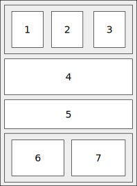

1. Реализовать интерфейс Мессенджера с помощью VBox и HBox
   1. Добавьте в список контактов несколько человек, научите кнопку посылать сообщение в
   историю сообщений, запретите изменения в истории сообщений
   1. Реализовать точно такой же интерфейс с помощью GridPane

1. Реализуйте программу, которая показывает на экране круг и дает возможность изменять его
   размер, цвет и т.п. Окно приложения разделено на две части, в левой части находятся
   элементы управления для выбора цветов и размеров круга, в правой части находится круг.
   Нужны следующие элементы управления: Slider для выбора радиуса круга,
   два ColorPicker для выбора цвета круга и цвета фона. Добавьте заодно метки с текстом,
   чтобы было понятно, где радиус, где цвет фона, где цвет круга.

    1. Начните с создания левой части интерфейса, добавьте на левую панель все элементы
    интерфейса.

    1. Наполните правую часть интерфейса, она должна состоять из панели Pane, которая будет
    являться фоном и, соответственно, раскрашиваться и отвечать за цвет фона. На панели должен
    лежать Circle. Это такой узел (Node), который изображается в виде круга указанного радиуса.
    1. Свяжите цвет из первого ColorPicker c цветом круга.
    1. Свяжите значение из Slider с радиусом круга.
    1. Свяжите цвет из второго ColorPicker c цветом фона.
    1. Свяжите координаты x и y круга с половиной, соответственно, ширины и высоты правой панели.
    Тем самым круг расположится ровно по центру панели.
    1. Свяжите максимальное значение слайдера выбора радиуса с максимально возможным радиусом
    круга, при котором круг все еще помещается на панель.

1. Цвета.

   

   Создайте JavaFX окно со структурой, указанной на
   рисунке: на сцене находится `VBox`, внутри него 7 `ImageView`,
   первые три и последние два объединены в `HBox`.
   
   Каждый `ImageView` содержит изображение, они перечислены
   ниже: 
   
   1. Создайте `WritableImage` размера 120 на 100, в нем все пиксели должны быть зеленые.
   Вы можете использовать код из лекции.
   2. Создайте `WritableImage` размера 256 на 256. Каждый пиксель должен иметь цвет,
   в котором R = 0, G = $x$, B = $y$, где $x$ и $y$ — это координаты пикселя от 0 до 255.
   Вам понадобится написать цикл, аналогичный предыдущему пункту.
   3. Создайте `WritableImage` размера 256 на 256. Каждый пиксель должен иметь цвет,
   в котором R = $x$, G = $x$, B = $y$, где $x$ и $y$ — это координаты пикселя от 0 до 255.
   4. Создайте `WritableImage` размера 360 на 100.  Каждый пиксель должен иметь цвет
   в пространстве HSB,
   в котором H = $x$, S = $y$ / 99, B = 1.
   Нам приходится делить $y$ на 99 потому что значение S должно быть от 0 до 1, при
   том что $y$ меняется от 0 до 99. 
   5. Создайте `WritableImage` размера 360 на 140.  Каждый пиксель должен иметь цвет
      в пространстве LCH,
      в котором L = 80, C = $y$, H = $x$.
      Нам приходится делить y на 99 потому что значение S должно быть от 0 до 1, при
      том что $y$ меняется от 0 до 99.
   6. Это должно быть любое изображение с диска или из Интернета, только загрузить
   его надо в размер 256 на 256, чтобы оно не было очень большое.
   7. Задача — привести изображение из предыдущего пункта к черно-белому. Для этого
   получите
   у изображения `PixelReader` с помощью метода `getPixelReader()`. Этот объект
   позволяет узнавать цвета отдельных пикселей с помощью метода `getColor()`.
   Дальше нужно создать новый `WritableImage` такого же размера, как изображение.
   Каждый пиксель исходного изображения нужно превратить в серый пиксель
   той же яркости. Воспользуйтесь формулой $0.2126R+0.7152G+0.0722B$, чтобы посчитать
   яркость пикселя, и создайте на новой картинке пиксель с серым цветом этой
   яркости.

