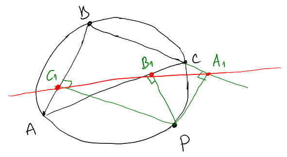
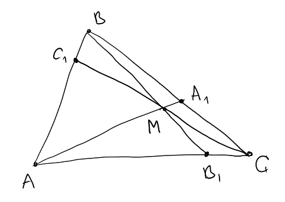

# GeoGebra tasks

## School geometry

In all the following tasks you should create a construction. You are encouraged to visually design it, such as hide not important lines, change colors, etc.

You are not supposed to prove any fact from geometry, you constructions shouls just demonstrate the facts.

1. **task_three_perpendiculars**. Draw a triangle $ABC$ with free vertices (a user may move vertices), its circumscribed circle and a free point $X$ on this circle. Then drop perpendiculars from $P$ to the sides of the triangle. Demonstrate, that all the three perpendicular bases lay on one line.
  
2. **task_chevy_theorem**. Draw a triangle $ABC$ with free vertices and an arbitrary point $M$ inside. A point $A_1$ is the intersection of the side $BC$ and the line $AM$.  A point $B_1$ is the intersection of the side $AC$ and the line $BM$. A point $C_1$ is the intersection of the side $AB$ and the line $CM$.
  
  Demonstrate that the expressions about lengths $\frac{|AB_1|}{|B_1C|}\frac{|CA_1|}{|A_1B|}\frac{|BC_1|}{|C_1A|}$ equals $1$.
3. ... the Euler line ... and the Euler circle (to be written) 
