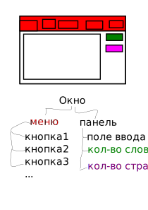

# JavaFX

Библиотека для создания UI. Интерфейс рисуется библиотекой самостоятельно, не используется интерфейс ОС. Т.е. окна выглядт характерным для JavaFX образом, не похоже на то, как выглядят обычно окна других программ. В Windows окна рисуются единообразно. В Linux бывают Gnome, KDE (Qt), ...
Достоинства: программа на JavaFX на всех платформах выглядит одинаково. Недостаток: зато не так, как выглядят другие программы.
Достоинство: можно менять внешний вид программы.

Вообще, существуют вспомогательные инструменты, чтобы создавать интерфейсы JavaFX программ. Это умеет IDEA и другие IDE. Можно создать окно, поставить на него кнопки, написать тексты на кнопках и т.д.
Для целей курса лучше мы будем создавать интерфейс только кодом, без инструментов рисования интерфейса.

## Сцена интерфейса
Сцена состоит из элементов интерфейса, они расположены друг относительно друга. Некоторые эл-ты интерфейса содержат внутри себя другие. Интерфейс = меню и область с текстом. Меню содержит кнопки, область с текстом содержит поле ввода текста и «метки» с текстом с информацией о количестве слов.

Сцена образует иерархию, каждый элемент находится либо на сцене, либо на каком-то другом.

Какие бывают элементы. Каждый элемент имеет тип
Node. Сцена собирается именно из Node. Они бывают разные.

Parent extends Node - это особый вид узлов, которые могут иметь на себе другие. Например, панельки, на которых можно располагать кнопки. Не все Node являются Parent. **Не Parent** это, например, ImageView. Компонент для просмотра изображений.

Parent бывает двух видов: Group и Region.
class Group extends Parent
class Region extends Parent

Различие в том, как устроен «размер» таких узлов. Group не имеет фиксированного размера, он вычисляется по содержимому. Т.е. у группы невозможно дать команду типа
myGroup.width = 100;

А вот у Region есть явный размер, содержимое под этот размер может подстраиваться. Т.е. например, если у панельки есть размер, и вы говорите, что кнопка находится справа снизу, то кнопка поймет по размеру панели, где именно это место.
Кроме этого, у регионов можно рисовать рамки и вообще делать то, что можно делать с css элементами (margin, padding, border).

Регионы двух основных типов: Control и Pane
Control - элемент управления типа кнопки
Pane - панелька для расположения других элементов.

Pane можно создавать напрямую: new Pane() и располагать на ней другие элементы.
Но Pane() сам по себе не следит за расположением элементов на нем, кнопки будут по тем координатам, которые мы сами должны указать. Другие Pane (VBox extends Pane, HBox extends Pane) сами располагают на себе элементы. Например, VBox расставляет элементы друг за другом по вертикали.

Какие бывают Pane - см. далее.

## Предпочитаемый размер PreferredSize

Каждый узел типа Region, в частности все контролы, все панельки имеют предпочитаемый размер (ПР). Этот размер им кажется наиболее удобным, чтобы оптимально отобразить все свое содержимое.

ПР у кнопки зависит от содержимого, чтобы текст поместился по высоте и по ширине.
Когда панельки располагают элементы, они могут учитывать или не учитывать предпочитаемые размеры.

Ограничения. Это дополнительная информация, которую панелька знает о находящихся на ней элементах, которая помогает их располагать.
Например, VBox должна знать про элементы, которые на ней находятся, можно ли их растягивать в высоту. Эти ограничения надо уметь указывать, у каждой панельки они указываются немного по-разному.

