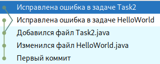
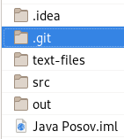

# Основы Git

## Предупреждение

Система контроля версий Git - это сложная программа, основанная
на сложных понятиях, и далеко не каждый программист хорошо в ней
разбирается. Тем не менее, ей или ее аналогами пользуются
все. Сейчас невозможно представить себе программирование
без систем контроля версий. Наша цель научиться пользоваться Git для выкладывания
решений своих задач. Нам потребуется только несколько простых сценариев
использования, поэтому я надеюсь, вы к ним быстро привыкнете и будете
считать git естественной частью процесса программирования.

Периодически вы будете сталкиваться со странными проблемами, из-за которых
у вас не будет получаться выложить решения, может потребоваться много времени,
чтобы разобраться. Обычно я помогаю с решением проблем в git, и, честно говоря, 
поэтому откладываю его изучение до конца — в начале при изучении
программирования и так достаточно разных трудностей для преодоления. Но сейчас
выбора нет, git наиболее удобен для того, чтобы я собирал ваши решения, иначе я
не справлюсь с потоком ваших решений в архивах, приложенных к письмам.  

Кроме git есть много других систем контроля версий, но сейчас именно
она является самой популярной. Она выиграла маркетинговую войну у
аналогов, даже более простых, удобный и быстрых, чем git.
И нам придется учить то же, что учат и используют все — git. 

## Системы контроля версий

### История изменения файлов в каталоге

Системы контроля версий имеют много возможностей, мы начнем с такой:
они позволяют хранить историю изменения файлов в каталоге. Вот пример
такой истории, она читается снизу вверх:

Здесь у программиста был каталог, он наполнил его файлами и решил
запомнить это состояние каталога. Запоминание текущего состояния каталога
— это операция, которая называется "commit". Поэтому первое состояние
он назвал «первый коммит».

После этого программист внес изменения в файле HelloWorld.java и снова
сохранил состояние каталога — сделал коммит. Он прокомментировал
его как «Изменился файл HelloWorld.java». После этого он продолжил
изменять файлы в каталоге, сделав еще два коммита.  

Введем термины. **Коммит** — это операция, которую программист выполняет,
чтобы запомнить состояние каталога. (русский вариант термина: фиксация).
**Ревизия** — это состояние каталога, которое появляется после
коммита. Соответственно, на предыдущей картинке мы видим четыре ревизии,
которые получены с помощью четырех коммитов (операций фиксации). 

Система контроля версий позволяет перемещаться между ревизиями. Эта
операция имеет название — **чекаут (checkout)** (по-русски: извлечение).
После нее можно получить каталог таким, каким он был в прошлом.

Из-за возможности перемещаться в прошлое, история может стать
нелинейной:

Здесь исправление ошибки в задаче HelloWorld и
ошибки в задаче Task2 было сделано на основе
одной и той же ревизии. Т.е. после того, как программист исправил ошибку
в задаче HelloWorld, он вернул прошлую версию каталога — до исправления 
ошибки — и изменил каталог по-другому.

Мы будем стараться избегать нелинейной истории, хотя полностью этого сделать
невозможно.

Последнее понятие в этом разделе —  **ветки**. Ветка — это указатель
на ревизию:

Ветки видны на этой картинке в виде ярлычков, они называются master
и task2. Кстати, на этой же картинке видно, что про каждую
ревизию хранится дополнительная информация: это имя автора и время
создания.

Ветка может перемещаться при коммитах. Например, если вернуться
к ревизии, помеченной веткой master и снова сделать коммит, картина
станет следующей:

Здесь ветка master переместилась к последней ревизии.

При реальном использовании git обычно считается, что ветка master указывает
на ревизию с последней стабильной версией программы. Такую программу
можно запустить и использовать. А другие ветки
создаются для того, чтобы пытаться реализовывать в них новые возможности
для программы. Когда новая возможность реализована и протестирована,
ее можно совместить (слить) с основной веткой master.

Мы не планируем создавать ветки, у нас будет одна ветка master. 

### Репозитории

Вся история изменения папки с вашим программным проектом, состоящая из
ревизий, хранится в репозитории. Технически, репозиторий — это тоже
папка на диске, она называется `.git` и находится внутри папки проекта:

Именно в папке `.git` хранятся все версии файлов, в моем примере эта папка
занимает около 190 килобайт, при том, что все остальные файлы и папки —
всего 90 килобайт.

Следующий текст до конца раздела можно пропустить при первом чтении.

Репозиторий хранит версии файлов эффективно, для этого
в папке сохранятся версии не целиком, а отличия версий друг от друга. Лучше
всего поэтому git подходит для хранения текстовых файлов, например, исходных
кодов программ. Чаще всего от ревизии к ревизии вы изменяете в коде своей
программы всего несколько строчек, и эти измененные строчки попадают
в репозиторий. А картинки даже при малейшем изменении в графическом
редакторе обычно очень сильно меняются на диске, и git приходится сохранять
новую версию картинки целиком.

Поэтому, не используйте репозиторий для хранения большого числа часто
меняющихся картинок. И помните, что если вы добавили картинку или другой
большой файл в репозиторий, то он останется там, даже если в очередной
ревизии вы его удалите. Это же относится и к тому, что вы можете случайно
сохранить свои пароли в репозитории, удалить их с помощью новых коммитов
не получится, нужно изменять историю репозитория, что достаточно сложно.

### Рабочая копия

Если в папке `.git` хранятся все ревизии репозитория,
то вне папки `.git` хранится **рабочая копия** репозитория. Это одна из
ревизий с текущими изменениями. Как было сказано выше, операция извлечения
(checkout) одну из ревизий перемещает из репозитория в рабочую копию.
И, как тоже было сказано выше, текущие изменения в рабочей копии можно
зафиксировать (commit), чтобы создать из них новую ревизию.

Для рабочей копии всегда известно, из какой ревизии она получилась, и у
рабочей копии часто есть ветка (см. выше). Самая частая ситуация у нас будет
такая: рабочая копия соответствует последней ревизии репозитория и
соответствующей ей ветке `master`. 

Старайтесь не делать checkout, если у вас есть какие-то текущие изменения,
потому что непонятно что должно случиться с этими изменениями, если
все ваши файлы заменятся на файлы из другой ревизии. Вообще,
фиксируйте свои изменения перед тем как сделать какое-то действие над 
репозиторием.

### git — распределенная система контроля версий

Git называется распределенной системой контроля версий. Это означает,
что можно хранить программу в нескольких репозиториях:

На картинке видно несколько компьютеров: личный ноутбук студента,
компьютер в университете,
смартфон преподавателя, на котором он планирует проверять задачи, и
общедоступный сервер в Интернете. На всех этих компьютерах хранится
программный проект студента с решениями задач. Ревизии можно пересылать
между репозиториями. Промежуточный пункт — сервер в Интернете, мы будем
использовать для этой цели сайт [github.com](https://github.com).
Это очень популярный сайт, фактически, стандарт для хранения репозиториев
открытых проектов и небольших личных репозиториев.

Как это происходит:

1. Студент решает задачи дома. Периодически делает коммиты в своем
репозитории на ноутбуке. Допустим, он сделал три коммита и получил,
соответственно, три ревизии.
1. После этого, он может отправить эти ревизии на сервер github.com.
Такая операция называется проталкивание (push). Три ревизии перемещаются
из домашнего репозитория в репозиторий на github.
1. Дальше студент приходит в университет или к другому своему домашнему
компьютеру и загружает ревизии с github, соответственно, на компьютере
появляются те же три ревизии, что были на ноутбуке. Эта операция называется
затягивание (pull).
1. Преподаватель тоже затягивает (pull) себе ревизии студента с сайта github.
Изучает их и обсуждает.
1. Студент на своем домашнем компьютере исправляет замечания преподавателя,
создавая (commit) еще одну ревизию, их становится 4 как на картинке.
1. Студент проталкивает свои изменения на github.com, и там тоже появляются
четыре ревизии.
1. Рабочий компьютер и преподаватель пока не затягивали (pull) себе изменения,
поэтому на них до сих пор всего по три ревизии. 
