# Первая практика с git

## Настройка git

Сначала убедимся, что IDEA может работать c git.

В диалоге настроек (File -> Settings) откройте пункт c git, для
этого я ввел git в поиске:

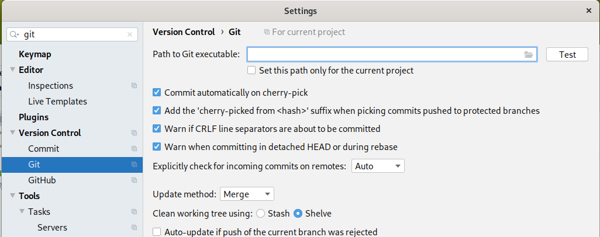

Если этого диалога нет, возможно, git не подключен. Маловероятно,
что это случится, но все равно проверьте в этом же диалоге
настроек пункт Plugins, чтобы убедиться, что плагин git
подключен.

В настройках git нас интересует верхний пункт Path to git executable.
Вы должны указать, где вы установили git. С некоторой вероятностью
IDEA нейдет git сама. Она тогда напишет, что он autodetected,
и вы можете нажать кнопку Test, чтобы проверить, что git
действительно обнаружен и работает.

Если не обнаружен, то нажимайте справа в поле ввода маленькую
кнопку browse и покажите каталог, где вы установили git. Внутри
нужно найти файл git.exe, он может быть в каталоге установки
или в подкаталоге bin. Обязательно нажмите Test в конце,
чтобы убедиться, что git работает.

## Инициализация репозитория

Откройте в IDEA свой проект с задачами. На всякий случай сделайте
ему резервную копию, т.е. скопируйте весь каталог проекта
в отдельное место. Хотя я не должен это писать, потому что вы
наверняка и так имеете резервные копии всех важным вам
данных.

Итак, проект открыт, найдите сверху меню VCS, это расшифровывается
как Version control system, т.е. система контроля версий.
Внутри выберите Enable Version Control Integration:

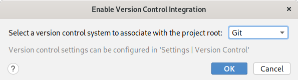

Здесь нужно выбрать, что вы создаете git репозиторий и нажать
Ok.

Откройте свой проект на диске, т.е. не через IDEA, и убедитесь,
что в папке проекта появилась папка .git. Подсказка: в панели
с файлами проекта, она слева, нажмите на любой файл или каталог,
и выберете вариант, который называется Show in Files (если
у вас linux), Show in Explorer (если у вас windows), Reveal
in Finder (если Mac). Вы увидите окно для просмотра файлов
из вашей операционной системы, там и проверьте, что есть папка
.git.

Теперь у вас есть свой новый репозиторий! Только он пока
еще не содержит ни одной ревизии.

## Фиксируем изменения, наш первый коммит

Откройте вспомогательне окно Git внизу IDEA:

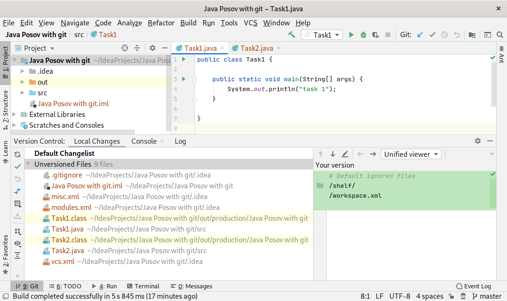

см. раздел, где искать окна, в лекции про работу с IDEA.

Выберите вкладку Local changes. Эта вкладка показывает
изменения, которые есть в вашей рабочей копии по сравнению
с репозиторием. Так как мы только начали, репозиторий пустой,
и в списке изменений мы видим вообще все файлы проекта.

Все действия с Git, про которые мы писали раньше (commit,
pull, push, checkout), можно найти в меню VCS или подразделе
Git меню VCS. Самые частые действия вынесены в кнопки на панелях
инструментов:

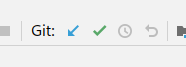

Сейчас нам нужно зафиксировать (commit) изменения. Найдите
эту операцию в меню VCS или нажмите зеленую галочку.
Вы увидите диалог для фиксирования изменений:

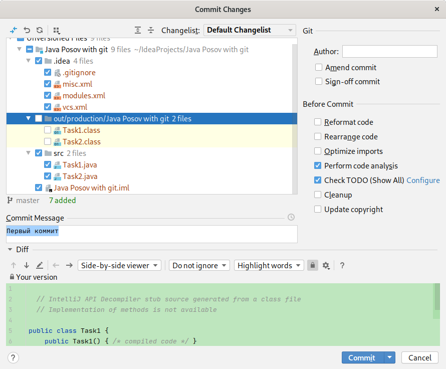

**Будьте предельно внимательны сейчас и всегда с этим диалогом.**
Большинство проблем с git начинаются из-за неправильных
коммитов. Дело в том, что системы контроля версий очень
серьезно относятся к истории изменений, и простых способов
исправить что-то в истории не существует. Просто так взять
и отменить коммит, т.е. удалить ревизию из истории, очень сложно.
Особенно, если эта ревизия уже отправлена в какой-то
другой репозиторий, например, github. Обычно проще не
изменять уже существующую ревизию, а создать новую.

**На что обратить внимание сейчас**.
1. Выделите все файлы, которые вы видите в списке, **кроме каталога `out`**.
Мы не будем хранить `out` в репозитории потому что, во-первых, файлы оттуда
занимают много места, во-вторых, постоянно меняются, значит должны попадать
в каждый коммит, в-третьих, их просто нет смысла хранить, потому что
каждый владелец репозитория может скомпилировать их сам.
1. Напишите ниже комментарий к коммиту. Например, «первый коммит». Их
обычно пишут на английском, но напишите по-русски, если хотите.
1. **Уберите справа галочки** Perform code analysis и Check TODO. Это полезные
галочки, но они замедляют процесс и отвлекают на себя. Нам пока и так есть
на что отвлекаться.
1. Жмите кнопку Commit.

Возможно, вас попросят указать ваше имя, дело в том, что
каждый коммит должен иметь автора. Вы один раз скажете,
как вас зовут, после этого все коммиты будут подписываться
вашим именем.

Теперь мы имеем первый коммит и, соответственно, первую ревизию.
Посмотрим снова на вкладку локальных изменений:

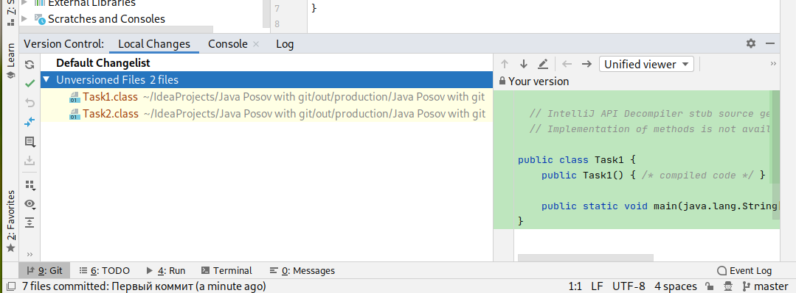

Здесь остались только несколько class файлов из каталога out, это файлы,
которые пока не находятся в системе контроля версий. Вспомните, что мы
не коммитили ни один файл из каталога out.

Переключитесь на вкладку Log (журнал):

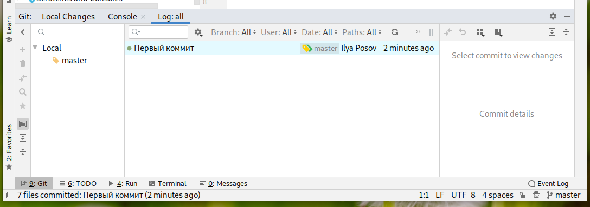

Мы видим, что в истории есть одна ревизия, она помечена
комментарием "первый коммит". У ревизии виден автор Ilya
Posov. Там же видна ветка master, т.е. ветка master
указывает именно на эту единственную ревизию.

## Второй коммит

Давайте сделаем какое-нибудь изменение в коде. Я сделал
изменение в своем файле Task1.java и открыл вкладку Local
Changes:

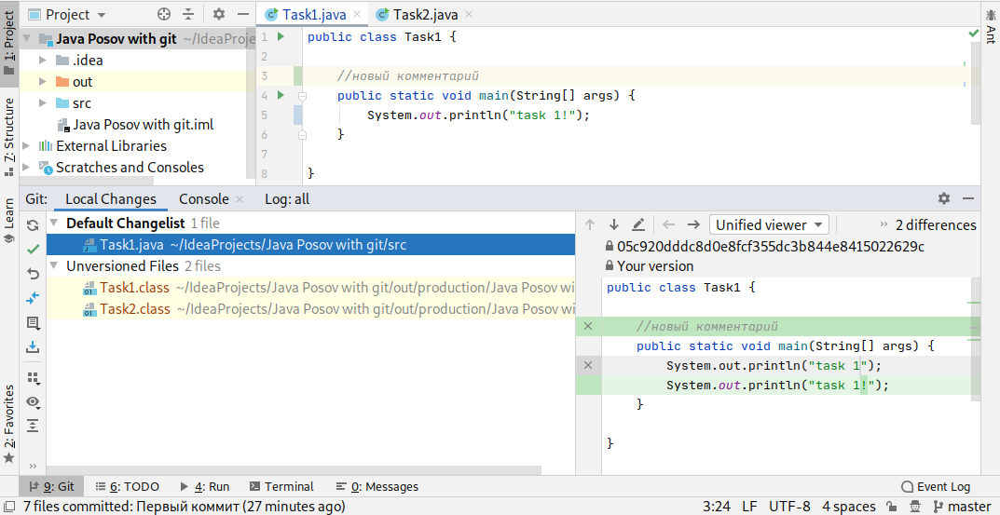

Здесь мы много всего видим на экране:

1. В окне с кодом программы я добавил строку
    ```
    // новый комментарий
    ```
    Слева от нее появилась зеленая отметка, она означает
    добавление. Еще я исправил строку
    ```
    Syste.out.println("task 1!");
    ``` 
    добавив восклицательный знак. Слева мы видим синюю отметку,
    которая означает изменение.
1. На цветные отметки можно нажать, увидеть, что было до
изменения, и можно вернуть, как было.
1. Снизу видны локальные изменения. В разделе Default
Changelist перечислен файл Task1.java, это тот файл, который
был изменен. Есть раздел Unversioned files с файлами
из каталога out, с которыми мы пока ничего не делаем.
1. Файл Task1.java в списке измененных файлов выделен. Поэтому
справа мы видим содержимое этого файла с демонстрацией того,
что конкретно изменилось. Видно, какие строки добавились,
какие изменились.
1. Двойной щелчок на файле Task1.java покажет более подробный диалог
со списком изменений в файле.

Теперь делаем коммит. Нажимаем на кнопку с зеленой галочкой,
или ищем commit в меню VCS, либо, как некоторые из вас
могли обратить внимание на сочетание клавиш,
нажимаем Ctrl + K.

Вот диалог:

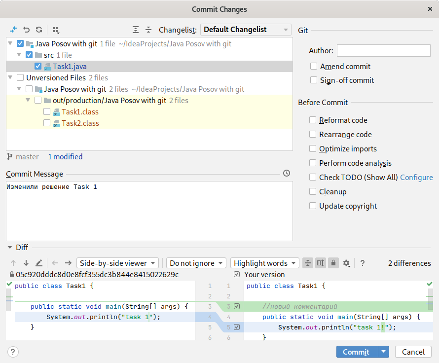
 
Здесь нужно убедиться, что в списке файлов стоит галочка
на файле Task1.java, и **не стоят** галочки на файлах 
из каталога `out`.

В этом диалоге снова видно, какие именно изменения в каких
файлах были сделаны. Это видно внизу окна, или можно сделать
двойной щелчок на любом файле, чтобы открыть сравнение
файла с его неhизмененной версией.

Вводите комментарий к коммиту, у меня это "Изменили решение
Task 1", и жмите Commit.

Переходим во вкладку с журналом изменений и видим, что теперь
мы имеем две ревизии:

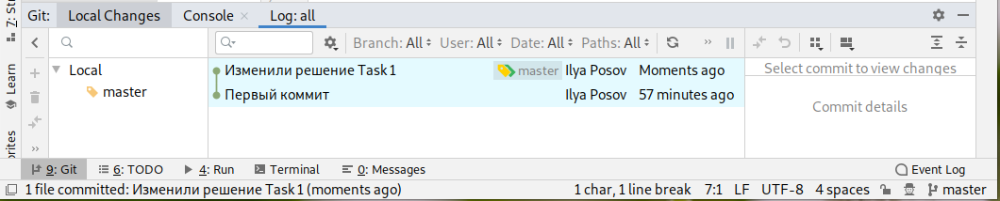

## Добавляем новые файлы

Попробуйте сделать еще несколько изменений сами. Внесите
незначительные изменения в любые ваши файлы и закоммитьте
их. Убедитесь, что вы не коммитите файлы из каталога `out`,
в диалоге коммита они должны всегда быть без галочек.
Вот что получилось у меня:

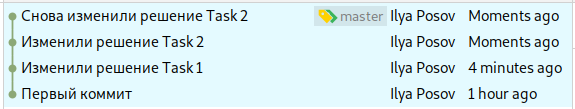

Видно, кстати, что ветка master движется вместе с коммитами.
Т.е. каждый раз после коммита ветка master указывает на
новую ревизию (вспоминаем: ветка это указатель на ревизию).

Потом попробуйте добавить в проект новый файл. Создайте
класс, например. Вы увидите диалог:

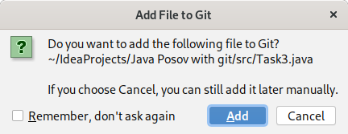

Вас спрашивают, нужно ли добавить этот файл в репозиторий.
Обычно, вы отвечаете, что добавить нужно. Мы действительно хотим
хранить этот файл в репозитории. Пока что мы не хотим
хранить только файлы из каталога `out`.

Заметьте, что файлы в списке файлов имеют разные цвета:

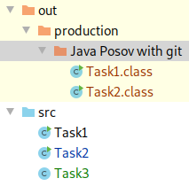

Зеленый файл — добавленный. Синий — измененный. Черный —
не измененный. Красный — файл, который мы не храним
в репозитории. Эта информация повторяет информацию из
окна про локальные изменения, там тоже видно, какие
файлы изменились после последнего коммита. 

Если вы случайно скажете, что не нужно добавлять файл
в репозиторий, и он останется красным, то вы всегда
можете нажать на файл правой кнопкой, выбрать пункт
меню git, и внутри выбрать Add. Файл станет зеленым.

## Явное игнорирование файлов

Все время, пока мы делали предыдущие действия, нас очень
расстраивали файлы из каталога `out`, приходилось проверять,
что они не участвуют в коммите. Давайте один раз и навсегда
скажем, чтобы git больше не спрашивал нас про эти файлы.

Создайте в корне каталога файл `.gitignore`, будьте внимательны,
он должен называться именно так, и никак иначе. Файл
`.gitignore` нужно добавить в репозиторий, на картинке
он зеленый:

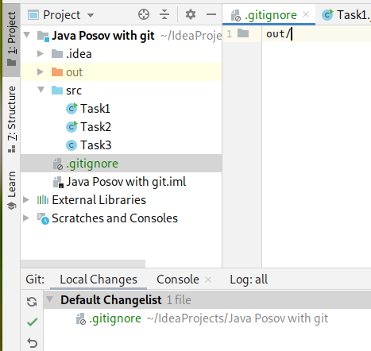

В файле нужно написать `out/`, это означает, что мы игнорируем
каталог out. Во вкладке Local Changes нажмите слева верхнюю
кнопку «обновить» из двух круглых стрелочек, и вы увидите,
что все файлы из каталога `out` больше не появляются в списке
изменений. Диалог коммита тоже забудет об этих файлах.
Больше они нам не мешают. Сделайте коммит, скажите в
комментарии, что вы добавили `.gitignore`.

После всех заданий у меня получилась такая история в репозитории:

 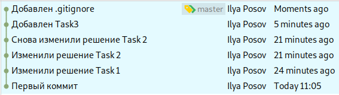
