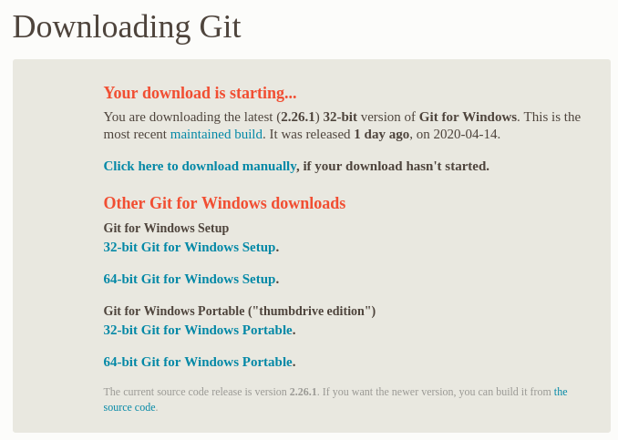

# Установка git

Загрузка git доступна по ссылке:
[Загрузка git](https://git-scm.com/downloads).
Для windows вы можете скачать установщик, либо выбрать
портативную версию (portable "thumbdrive edition"),
чтобы вместо установки просто
разархивировать себе git в какое-то удобное место.

На linux вы можете установить git через пакет `git`.

При установке убедитесь, что вы запомнили, в какой каталог
его установили или разархивировали.

Чистый git сложен в использовании, потому что им нужно
пользоваться через командную строку, самих команд много,
и они требуют большого количества неочевидных параметров.
Как я писал раньше, git — не самая простая система контроля
версий, и я бы с удовольствием учил какой-нибудь другой,
если бы git не был настолько популярен.

Намного удобней пользоваться git через программы с 
графическким интерфейсом,
таких программ очень много, они очень упрощают работу с
git и делают ее доступной для всех. Вы можете встретить
названия TortoiseGit, SourceTree, можете их поставить, но
нам они не понадобятся, мы будем пользоваться IDEA, которая
имеет все необходимые нам возможности по работе с git.
